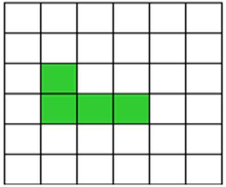
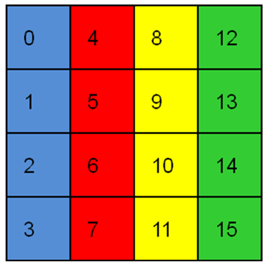
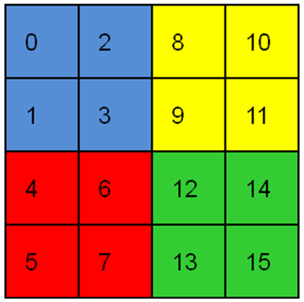

Restricted Arrays
=================

Overview
--------

The restricted arrays functionality is designed to provide users with
further options for how data is distributed among processors by allowing
them to reduce the total number of processors that actually have data
and also by allowing users to remap which data blocks go to which
processors. There are two calls that allow users to create restricted
arrays; both must be used with the new interface for creating arrays.
This requires that users must first create an array handle using the
``ga_create_handle`` call and then apply properties to the handle using
different ga_set calls. The two calls that allow users to create
restricted arrays are ``ga_set_restricted`` and
``ga_set_restricted_range``. The first call is more general, the second
is a convenience call that allows users to create restricted arrays on a
contiguous set of processors.

Both calls allow users to restrict the data in a global array to a
subset of available processors. The set ga_set_restricted call has two
arguments, ``nproc``, and an array ``list`` of size ``nproc``. Nproc
represents the number of processors that are supposed to contain data
and list is an array of the processor IDs that contain data. For the
array shown in :numref:`Figure %s <GAon36Processors>`, the problem is run
on 36 processors but for nproc=4 and list=[8,9,15,21] only the
processors shown in the figure will have data. The array will be
decomposed assuming that it is distributed amongst only 4 processors so
it will be broken up using either a 2x2, 1x4, or 4x1 decomposition. The
block that would normally be mapped to process 0 in a 4 processor
decomposition will go to process 8, the data that would map to process 1
will go to process 9, etc. This functionality can be used to create
global arrays that have data limited to a small set of processors but
which are visible to all processors.

.. _GAon36Processors:

   A global array distributed on 36 processors. If
   nproc=4 and list = [8,9,15,21] then only the shaded processor will
   contain data. The array will be decomposed into 4 blocks.

The restricted array capability can also be used to alter the default
distribution of data. This is ordinarily done in a column major way on
the processor grid so that a global array created on 16 processors that
has been decomposed into a 4x4 grid of data blocks would have data
mapped out as shown in :numref:`Figure %s <GA-16-Standard-data-distribution>`. 
The first column of blocks is assigned to processes 0-3, the second to processes 4-7, etc.

.. _GA-16-Standard-data-distribution:

   Standard data distribution for a global array created on 
   16 processors and decomposed into a 4x4 grid of data blocks.

:numref:`Figure %s <GA-16-An-alternative-distribution>` shows an
alternative distribution that could be achieved using restricted arrays
and setting the list array to [0,1,4,5,2,3,6,7,8,9,12,13,10,11,14,15].
This distribution might but useful for reducing intranode communication
for multiprocessor nodes

.. _GA-16-An-alternative-distribution:

   An alternative distribution that could be achieved using 
   restricted arrays. An array on 16 processors decomposed 
   into a 4x4 grid of data blocks.

Restricted Arrays Operations
----------------------------

- Fortran subroutine: ga_set_restricted(g_a, list, nproc) 

- C:       void GA_Set_restricted(int g_a, int list[], int nproc) 

- C++:     GA::GlobalArray::setRestricted(int list[], int nproc) const

This subroutine restricts data in the global array ``g_a`` to only the
``nproc`` processors listed in the array list. The value of ``nproc``
must be less than or equal to the number of available processors. If
this call is used in conjunction with ``ga_set_irreg_distr``, then the
decomposition in the ``ga_set_irreg_distr`` call must be done assuming
the number of processors used in the ``ga_set_restricted`` call. The
data that would ordinarily get mapped to process 0 in an ``nproc``
distribution will get mapped to the processor in ``list[0]``, the data
that would be mapped to process 1 will get mapped to ``list[1]``, etc.
This can be used to restructure the data layout in a global array even
if the value of ``nproc`` equals the total number of processors
available.

- Fortran subroutine: ga_set_restricted_range(g_a, list, nproc) 

- C:       void GA_Set_restricted_range(int g_a, int lo_proc, int hi_proc) 

- C++:     GA::GlobalArray::setRestrictedRange(int lo_proc, int hi_proc) const

This subroutine restricts data in the global array ``g_a`` to the
processors beginning with\ ``lo_proc`` and ending with ``hi_proc``. Both
``lo_proc`` and ``hi_proc`` must be less than or equal to the total
number of processors available minus one (e.g., in the range ``[0,N-1]``
where N is the total number of processors) and ``lo_proc`` must be less
than or equal to ``hi_proc``. If ``lo_proc=0`` and ``hi_proc=N-1`` then
this command has no effect on the data distribution. This call is
equivalent to using the ``ga_set_restricted`` call where
``nprocs = hi_proc-lo_proc+1`` and the array ``list`` contains the
processors ``[lo_proc, hi_proc]`` in consecutive order.
