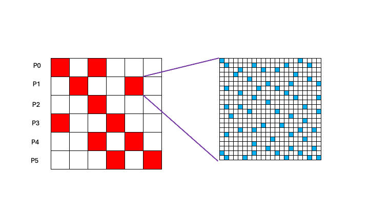

Sparse Array Operations
=======================

Global Arrays provides some capability for creating and manipulating
sparse 2D arrays. This includes functionality for creating a 2D array,
basic operations for extracting and setting array diagonals, basic
linear algebra operations for sparse matrix-vector muliply and
matrix-matrix multiply and additional operations for directly accessing
the data inside the sparse array. These operations are sufficient to
allow users to build basic linear solvers, such as conjugate gradient
and BiCGSTAB and to support investigations into sparse data storage and
data manipulation.

The sparse array functionality in GA is accessible from both the C and
Fortran APIs, although at present date only the C-interface has been
extensively tested.

Creating a Sparse Array
-----------------------

The model for creating a sparse array is similar to other packages that
create sparse data structures, such as PETSc and Hypre. The sparse array
is initially created using a call to
``NGA_Sprs_array_create(int idim, int jdim, int type)``, where ``idim``
is the row dimension of the sparse array, ``jdim`` is the column
dimension of the sparse array and ``type`` is the GA datatype of the
array. This function is also available in a version that supports 64 bit
indexing
``NGA_Sprs_array_create64(int64_t idim, int64_t jdim, int64_t type)`` [1]_. 

The function returns an integer handle that can be used to
identify the array in subsequent array operations. Sparse arrays in
application can typically end up being much larger than dense arrays, so
the option to use 64 bit indexing is more important here. If a sparse
array is created with the 64 bit interface, then all other operations on
the array should also use the 64 bit versions of the operation, if they
are available. Some internal data structures containing the locations of
the non-zero values of the sparse array elements are sized to 64 bits
when the 64 bit interface is used and other operation may fail if the
wrong interfaces is used on the array.

Once the sparse array has been created, the non-zero elements can be
added to the array with the
``NGA_Sprs_array_add_element(int s_a, int idx, int jdx, void *val)`` or
``NGA_Sprs_array_add_element64(int s_a, int64_t idx, int64_t jdx, void *val)``
function. The handle ``s_a`` identifies the sparse array, ``idx`` and
``jdx`` are the row and column indices and ``val`` is the value of the
array element. Any process can add any element to the array, the only
restriction is that an array element can only be added once. It is a
good idea to make sure that all diagonal elements of the array are
added, even if they happen to be zero. Some array operations may fail if
some diagonal entries are missing.

Finally, once all elements have been added to the array, it is time to
assemble the array into a final form that can be used for computation by
calling the ``NGA_Sprs_array_assemble(int s_a)`` function. This function
sorts individual elements onto processors and further organizes the data
within processors so that it is ready for computation. The final data
layout is illustrated in :numref:`Figure %s <schematic-layout-sparse>`. The row dimension
of the sparse array is divided into roughly equal sized segments and all
the elements with a row index falling within a row segment are assigned
to the corresponding processor. The column dimension is partitioned in
the same way and the row block on each processor is divided into blocks
of data corresponding to the column partition. Nominally, the number of
blocks of data corresponds to the number of processors, but in many
applications, the column blocks may be empty. If the block is empty,
then no memory is allocated for that block. Each of the non-zero blocks
is stored using a compressed sparse row format (CSR). This data may be
accessed directly by the process hosting the data or it can be retrieved
from a remote locate and copied into local buffers. The overall data
layout of the sparse matrix can be characterized as a sparse array of
sparse blocks.

.. _schematic-layout-sparse:

   Schematic layout of sparse matrix data distribution. Original matrix
   is partitioned along the row axis and each partition is assigned to a
   process. Data within a row block is further partitioned along the
   column axis into sparse blocks. Final data structure is a sparse
   array of sparse blocks.

Alternatively, it is possible to create a new sparse array from an
existing sparse array using the function
``NGA_Sprs_array_duplicate(int s_a)`` which returns a handle to a new
sparse array that is a duplicate of the original array ``s_a``. The new
array can then be modified using some of the functions described in the
next section.

Finally, when you are done with array, it can be removed from the system
with the command ``NGA_Sprs_array_destroy(int s_a)``. This will free up
all resources associated with the array.

Collective Operations on Sparse Arrays
--------------------------------------

Once a sparse array has been created, it can be used in several
collective operations on distributed data. The most important of these
is sparse matrix-vector multiplication, where the vector is an ordinary
global array of dimension 1. This operation is of the form
``NGA_Sprs_array_matvec_multiply(int s_a, int g_x, int g_b)`` and
corresponds to the multiplication
:math:`\overline{\overline{A}}\cdot\overline{x}
=\overline{b}`. The handles ``g_x`` and ``g_b`` are ordinary global
arrays of dimension 1. Note that the length of ``g_x`` and ``g_b`` must
match the column dimension of the sparse matrix ``s_a``. Matrix-vector
multiplication is a major operation used in iterative solvers.

Many algorithms involving sparse matrices manipulate the diagonal, and
some operations are included that enable users to extract and modify
diagonal values. Note that these operations are very likely to fail if
not all diagonal values have been included in the sparse matrix, so it
is generatlly a good idea to include diagonal values in the sparse array
even if they are zero. The first operation extracts the diagonal values
and stores them in a distributed 1 dimensional global array
``NGA_Sprs_array_get_diag(int s_a, int *g_d)`` where ``g_d`` is an
ordinary global array of dimension 1. The diagonals can also be shifted
by a constant value using the function
``NGA_Sprs_array_shift_diag(int s_a, void *shift)`` where the variable
``shift`` is the amount the diagonal should be incremented.

Other operations include left and right multiplication by a diagonal
matrix. The diagonal matrix is represented by a 1 dimensional global
array containing the diagonal values. The multiplication operations can
be completed using the functions
``NGA_Sprs_array_right_multiply(int s_a, int g_d)`` and
``NGA_Sprs_array_left_multiply(int s_a, int g_d)``. The handle ``g_d``
is the global array containing the diagonal elemenents.

The sparse matrix library also supports sparse matrix-sparse matrix
multiplication through the function
``NGA_Sprs_array_matmatm_multiply(int s_a, int s_b)``. This operation
multiplies the sparse matrices ``s_a`` and ``s_b`` together and returns
a handle to a new sparse matrix representing the product.

Direct Access to Sparse Matrix Data
-----------------------------------

GA provides basic functionality on sparse matrices that can be used to
construct more complex algorithms. In addition, an array of tools
provides direct access to the data stored in the sparse array enabling
users to both access and modify the sparse array in more complicated
ways. The most basic operations for understanding data layout are the

``NGA_Sprs_array_row_distribution(int s_a, int iproc, int *rlo, int *rhi)``

and

``NGA_Sprs_array_column_distribution(int s_a, int iproc, int *clo, int *chi)``
functions. For the given processor ``iproc`` these function return the
bounding indices of the corresponding row or column partition. Data for
all rows between ``rlo`` and ``rhi`` are located on processor ``iproc``.
On each processor, this data is further organized into CSR formatted
subblocks based in the column partition. Note that in many cases, the
subblocks may be empty. These distribution functions are also available
with 64 bit interfaces.

The ``NGA_Sprs_array_col_block_list(int s_a, int **idx_x, int *n)``
function returns a list of the column blocks that contain data on the
calling process. In C, the pointer ``*idx`` is allocated by this
function and must be freed by the calling program. In Fortran, the array
``idx`` is assumed to have already been allocated and the variable ``n``
on input is the length of ``idx``. On output, ``n`` is the number of
non-zero blocks. The data inside the column blocks can be accessed
directly using

``NGA_Sprs_arrayt_access_col_block(int s_a, int icol, int **idx, int **jdx, void **val)``.
This function returns pointers to the column block data in CSR format.
The bounding indices for this data can be obtained using the
distribution functions. This function is also available in a 64 bit
version. If the column block corresponding to ``iproc`` is empty, the
pointers returned by the function are ``NULL``. The row indices ``idx``
array contains the starting location of the column indices and values
for all non-zero values in the row. The number of entries in ``idx`` is
``rhi-rlo+2``. The extra entry is included so that the number of
non-zero entries in any row can be calculated using ``idx[i+1]-idx[i]``,
even for the last row in the block. The absolute row index of the row
indexed by ``i`` in ``idx`` can be calculated using ``i+rlo``. The array
``jdx`` contains the absolute column indices for the entry. The relative
column index in the block can be recovered using ``j=jdx[k]-clo``.

Any column block in the sparse array can be recovered using the
``NGA_Sprs_array_get_block(int s_a, int irow, int icol, int **idx, int **idx, void *val, int *rlo, int *rhi, int *clo, int *chi)``
function. This function is also available in a 64 bit version. The
indices ``irow`` and ``icol`` are the row and column indices of the
desired block. The values of these indices are bounded by the number of
processors. The CSR formatted data is returned in the arrays ``idx``,
``jdx`` and ``val``. If the block contains no data, these arrays are
``NULL``. These arrays are allocated by the function and must be freed
by the calling program. The indices ``rlo,rhi,clo,chi`` are the bounding
indices for the block in a 64 bit version.

.. [1]
   If a sparse array is created using the 64 bit interface, then the GA
   library should be build with 64 bit index support.
