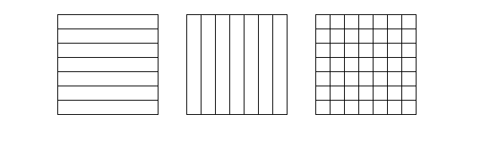
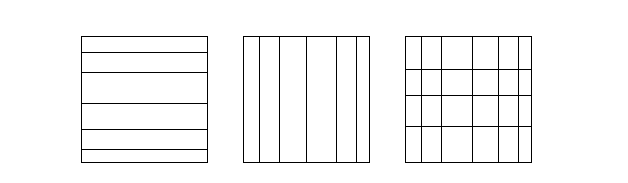
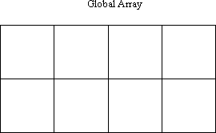
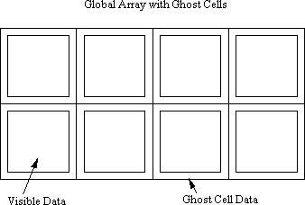

.. _sec:Initialization-and-Termination:

Initialization and Termination
==============================

For historical reasons (the 2-dimensional interface was developed
first), many operations have two interfaces, one for two dimensional
arrays and the other for arbitrary dimensional (one- to seven-
dimensional, to be more accurate) arrays. The latter can definitely
handle two dimensional arrays as well. The supported data types are
integer,double precision, and double complex. Global Arrays provide C
and Fortran interfaces in the same (mixed-language) program to the same
array objects. The underlying data layout is based on the Fortran
convention.

GA programs require message-passing and Memory Allocator (MA) libraries
to work. Global Arrays is an extension to the message-passing interface.
GA internally does not allocate local memory from the operating system -
all dynamically allocated local memory comes from MA. We will describe
the details of memory allocation later in this section.

Message Passing
---------------

The first version of Global Arrays was released in 1994 before robust
MPI implementations became available. At that time, GA worked only with
TCGMSG, a message-passing library that one of the GA authors (Robert
Harrison) had developed before. In 1995, support for MPI was added. At
the present time, the GA distribution still includes the TCGMSG library
for backward compatibility purposes, and because it is small, fast to
comple, and provides a minimal message-passing support required by GA
programs. The MPI-compatible version of GA became the default as of
version 5.0.

The GA toolkit needs the following functionality from any
message-passing library it runs with:

-  initialization and termination of processes in an SPMD
   (single-program-multiple-data) program,

-  synchronization,

-  functions that return number of processes and calling process id,

-  broadcast,

-  reduction operation for integer and double datatypes, and

-  a function to abort the running parallel job in case of an error.

The message-passing library has to be initialized before the GA library
and terminated after the GA library is terminated.

GA provides two functions *ga_nnodes* and *ga_nodeid* that return the
number of processes and the calling process id in a parallel program.
Starting with release 3.0, these functions return the same values as
their message-passing counterparts. In earlier releases of GA on
clusters of workstations, the mapping between GA and message-passing
process ids were nontrivial. In these cases, the *ga_list_nodeid*
function (now obsolete) was used to describe the actual mapping.

Although message-passing libraries offer their own barrier (global
synchronization) function, this operation does not wait for completion
of the outstanding GA communication operations. The GA toolkit offers a
*ga_sync* operation that can be used for synchronization, and it has the
desired effect of waiting for all the outstanding GA operations to
complete.

.. _sub:Memory-Allocation:

Memory Allocation
-----------------

GA uses a very limited amount of statically allocated memory to maintain
its data structures and state. Most of the memory is allocated
dynamically as needed, primarily to store data in newly allocated global
arrays or as temporary buffers internally used in some operations, and
deallocated when the operation completes.

There are two flavors of dynamically allocated memory in GA: shared
memory and local memory. Shared memory is a special type of memory
allocated from the operating system (UNIX and Windows) that can be
shared between different user processes (MPI tasks). A process that
attaches to a shared memory segment can access it as if it was local
memory. All the data in shared memory is directly visible to every
process that attaches to that segment. On shared memory systems and
clusters of SMP (symmetritc multiprocessor) nodes, shared memory is used
to store global array data and is allocated by the Global Arrays
run-time system called ARMCI. ARMCI uses shared memory to optimize
performance and avoid explicit interprocessor communication within a
single shared memory system or an SMP node. ARMCI allocates shared
memory from the operating system in large segments and then manages
memory in each segment in response to the GA allocation and deallocation
calls. Each segment can hold data in many small global arrays. ARMCI
does not return shared memory segments to the operating system until the
program terminates (calls *ga_terminate*).

On systems that do not offer shared-memory capabilities or when a
program is executed in a serial mode, GA uses local memory to store data
in global arrays.

All of the dynamically allocated local memory in GA comes from its
companion library, the Memory Allocator (MA) library. MA allocates and
manages local memory using stack and heap disciplines. Any buffer
allocated and deallocated by a GA operation that needs temporary buffer
space comes from the MA stack. Memory to store data in global arrays
comes from heap. MA has additional features useful for program debugging
such as:

-  left and right guards: they are stamps that detect if a memory
   segment was overwritten by the application,

-  named memory segments, and

-  memory usage statistics for the entire program.

Explicit use of MA by the application to manage its non-GA local data
structures is not necessary but encouraged. Because MA is used
implicitly by GA, it has to be initialized before the first global array
is allocated. The *MA_init* function requires users to specify memory
for heap and stack. This is because MA:

-  allocates from the operating system only one segment equal in size to
   the sum of heap and stack,

-  manages both allocation schemes using memory coming from opposite
   ends of the same segment, and

-  the boundary between free stack and heap memory is dynamic.

It is not important what the stack and heap size argument values are as
long as the aggregate memory consumption by a program does not exceed
their sum at any given time.

MA is optional for C programs. You can replace GA’s internal MA memory
handling with ``malloc()`` and ``free()`` by using the function
``GA_Register_stack_memory()``.

.. literalinclude:: code/replace_ma.c
   :language: cpp

Determining the Values of MA Stack and Heap Size
~~~~~~~~~~~~~~~~~~~~~~~~~~~~~~~~~~~~~~~~~~~~~~~~

How can I determine what the values of MA stack and heap size should be?

The answer to this question depends on the run-time environment of the
program including the availability of shared memory. A part of GA
initialization involves initialization of the ARMCI run-time library.
ARMCI dynamically determines if the program can use shared memory based
on the architecture type and current configuration of the SMP cluster.
For example, on uniprocessor nodes of the IBM SP shared memory is not
used whereas on the SP with SMP nodes it is. This decision is made at
run-time. GA reports the information about the type of memory used with
the function *ga_uses_ma()*. This function returns false when shared
memory is used and true when MA is used.

Based on this information, a programmer who cares about the efficient
usage of memory has to consider the amount of memory per single process
(MPI task) needed to store data in global arrays to set the heap size
argument value in ma_init. The amount of stack space depends on the GA
operations used by the program (for example *ga_mulmat_patch* or
*ga_dgemm* need several MB of buffer space to deliver good performance)
but it probably should not be less than 4MB. The stack space is only
used when a GA operaion is executing and it is returned to MA when it
completes.

GA Initialization
-----------------

The GA library is initialized after a message-passing library and before
MA. It is possible to initialize GA after MA but it is not recommended:
GA must first be initialized to determine if it needs shared or MA
memory for storing distributed array data. There are two alternative
functions to initialize GA:

TODO

and

TODO

The first interface allows GA to consume as much memory as the
application needs to allocate new arrays. The latter call allows the
programmer to establish and enforce a limit within GA on the memory
usage.

*Note*: In GA++, there is an additional functionality as follows:

TODO

Limiting Memory Usage by Global Arrays
~~~~~~~~~~~~~~~~~~~~~~~~~~~~~~~~~~~~~~

GA offers an optional mechanism that allows a programmer to limit the
aggregate memory consumption used by GA for storing Global Array data.
These limits apply regardless of the type of memory used for storing
global array data.They do not apply to temporary buffer space GA might
need to use to execute any particular operation. The limits are given
per process (MPI task) in bytes. If the limit is set, GA would not
allocate more memory in global arrays that would exceed the specified
value - any calls to allocate new arrays that would simply fail (return
false). There are two ways to set the limit:

#. at initialization time by calling ga_initialize_ltd, or

#. after initialization by calling the function

TODO

It is encouraged that the user choose the first option, even though the
user can intialize the GA normally and set the memory limit later.
Example: Initialization of MA and setting GA memory limits

::

   call ga_initialize() 
   if (ga_uses_ma()) then
      status = ma_init(MT_DBL, stack, heap+global) 
   else 
      status = ma_init(mt_dbl,stack,heap) 
   call ga_set_memory_limit(ma_sizeof(MT_DBL,global,MT_BYTE)) 
   endif 
   if(.not. status) ... !we got an error condition here

In this example, depending on the value returned from ga_uses_ma(), we
either increase the heap size argument by the amount of memory for
global arrays or set the limit explicitly through ga_set_memory_limit().
When GA memory comes from MA we do not need to set this limit through
the GA interface since MA enforces its memory limits anyway. In both
cases, the maximum amount of memory acquired from the operating system
is capped by the value *stack+heap+global*.

Termination
-----------

The normal way to terminate a GA program is to call the function

TODO

The programmer can also abort a running program for example as part of
handling a programmatically detected error condition by calling the
function

TODO

Creating Arrays - I
-------------------

There are three ways to create new arrays:

#. From scratch, for regular distribution, using

   TODO

   or for regular distribution, using

   TODO

#. Based on a template (an existing array) with the function

   TODO

#. Refer to the “Creating Arrays - II” section.

In this case, the new array inherits all the properties such as
distribution, datatype and dimensions from the existing array.

With the regular distribution shown in 
:numref:`Figure %s <regular-distribution>`, the programmer can specify block
size for none or any dimension. If block size is not specified the
library will create a distribution that attempts to assign the same
number of elements to each processor (for static load balancing
purposes). The actual algorithm used is based on heuristics.

.. _regular-distribution:

   Regular Distribution

With the irregular distribution shown in 
:numref:`Figure %s <irregular-distribution>`, the programmer specifies
distribution points for every dimension using map array argument. The
library creates an array with the overall distribution that is a
Cartesian product of distributions for each dimension. A specific
example is given in the documentation.

.. _irregular-distribution:

   Irregular Distribution

If an array cannot be created, for example due to memory shortages or an
enforced memory consumption limit, these calls return failure status.
Otherwise an integer handle is returned. This handle represents a global
array object in all operations involving that array. This is the only
piece of information the programmer needs to store for that array. All
the properties of the object (data type, distribution data, name, number
of dimensions and values for each dimension) can be obtained from the
library based on the handle at any time, see Section 7.4. It is not
necessary to keep track of this information explicitly in the
application code.

Note that regardless of the distribution type at most one block can be
owned/assigned to a processor.

Creating Arrays with Ghost Cells
~~~~~~~~~~~~~~~~~~~~~~~~~~~~~~~~

Individual processors ordinarily only hold the portion of global array
data that is represent by the lo and hi index arrays returned by a call
to nga_distribution or that have been set using the nga_create_irreg
call. However, it is possible to create global arrays where this data is
padded by a boundary region of array elements representing portions of
the global array residing on other processors. These boundary regions
can be updated with data from neighboring processors by a call to a
single GA function. To create global arrays with these extra data
elements, referred to in the following as ghost cells, the user needs to
call either the functions:

TODO

These two functions are almost identical to the ``nga_create`` and
``nga_create_irreg`` functions described above. The only difference is
the parameter array width. This is used to control the width of the
ghost cell boundaries in each dimension of the global array. Different
dimensions can be padded with different numbers of ghost cells, although
it is expected that for most applications the widths will be the same
for all dimensions. If the width has been set to zero for all
dimensions, then these two functions are completely equivalent to the
functions ``nga_create`` and ``nga_create_irreg``.

To illustrate the use of these functions, an ordinary global array is
shown in :numref:`Figure %s <OrdinaryGlobalArray>`. The boundaries
represent the data that is held on each processor.

.. _OrdinaryGlobalArray:

   
   Ordinary Global Array

For a global array with ghost cells, the data distribution can be
visualized as shown in :numref:`Figure %s <GAwGhostCells>`.

.. _GAwGhostCells:

   Global Array with Ghost Cells

Each processor holds “visible” data, corresponding to the data held on
each processor of an ordinary global array, and “ghost cell” data,
corresponding to neighboring points in the global array that would
ordinarily be held on other processors. This data can be updated in a
single call to ``nga_update``, described under the collective operations
section of the user documentation. Note that the ghost cell data
duplicates some portion of the data in the visible portion of the global
array. The advantage of having the ghost cells is that this data
ordinarily resides on other processors and can only be retrieved using
additional calls. To access the data in the ghost cells, the user must
use the ``nga_access_ghosts`` function described in Section 6.1.

Creating Arrays - II
--------------------

As mentioned in the previous section (“Creating arrays - I”), there are
3 ways to create arrays. This section describes method #3 to create
arrays. Because of the increasingly varied ways that global arrays can
be configured, a set of new interfaces for creating global arrays has
been created. This interface supports all the configurations that were
accessible via the old ga_create_XXX calls, as well as new options that
can only be accessed using the new interface. Creating global arrays
using the new interface starts by a call to ga_create_handle that
returns the user a new global array handle. The user then calls several
ga_set_XXX calls to assign properties to this handle. These properties
include the dimension of the array, the data type, the size of the
array, and any other properties that may be relevant. At present, the
available ga_set_XXX calls largely reflect properties that are
accessible via the nga_create_XXX calls, however, it is anticipated that
the range of properties that can be set using these calls will expand
considerably in the future. After all the properties have been set, the
user calls ga_allocate on the array handle and memory is allocated for
the array. The array can now be used in exactly the same way as arrays
created using the traditional ga_create_XXX calls. The calls for
obtaining a new global array handle are

TODO

Properties of the global arrays can be set using the ga_set_XXX calls.
Note that the only required call is to ga_set_data. The others are all
optional.

TODO

The argument *g_a* is the global array handle, *ndim* is the dimension
of the array, *dims* is an array of *ndim* numbers containing the
dimensions of the array, and *type* is the data type as defined in
either the macdecls.h or mafdecls.h files. Other options that can be set
using these subroutines are:

TODO

This subroutine assigns a character string as an array name to the
global array.

TODO

The chunk array contains the minimum size dimensions that should be
allocated to a single processor. If the minimum size is set to -1 for
some of the dimensions, then the minimum size allocation is left to the
GA toolkit. The default setting of the chunk array is -1 along all
dimensions.

TODO

The ga_set_irreg_distr subroutine can be used to specify the
distribution of data among processors. The block array contains the
processor grid used to lay out the global array and the map array
contains a list of the first indices of each block along each of the
array axes. If the first value in the block array is M, then the first M
values in the map array are the first indices of each data block along
the first axis in the processor grid. Similarly, if the second value in
the block array is N, then the values in the map array from M+1 to M+N
are the first indices of the each data block along the second axis and
so on through the D dimensions of the global array.

TODO

This call can be used to set the ghost cell width along each of the
array dimensions.

TODO

This call assigns a processor group to the global array. If no processor
group is assigned to the global array, it is assumed that the global
array is created on the default processor group.

After all the array properties have been set, memory for the global
array is allocated by a call to ga_allocate. After this call, the global
array is ready for use inside the parallel application.

TODO

This function returns a logical variable that is true if the global
array was successfully allocated and false otherwise.

Destroying Arrays
-----------------

Global arrays can be destroyed by calling the function

TODO

that takes as its argument a handle representing a valid global array.
It is a fatal error to call ga_destroy with a handle pointing to an
invalid array.

All active global arrays are destroyed implicitly when the user calls
``ga_terminate``.
