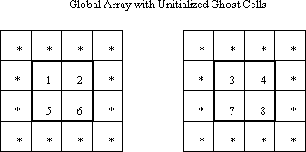
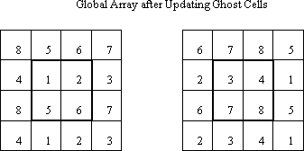
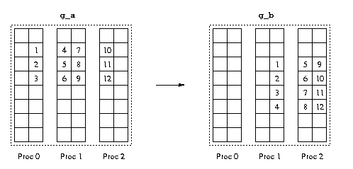
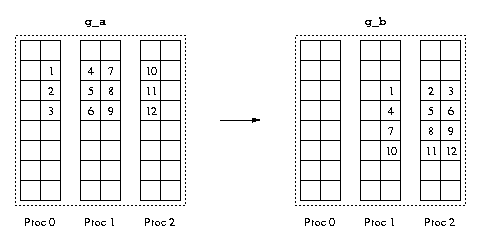

Collective Array Operations
===========================

Global Arrays provide functions for collective array operations,
targeting both whole arrays and patches (portions of global arrays).
Collective operations require all the processes to make the call. In the
underlying implementation, each process deals with its local data. These
functions include

-  basic array operations,

-  linear algebra operations, and

-  interfaces to third party software packages.

Basic Array Operations 
----------------------

Global Arrays provide several mechanisms to manipulate contents of the
arrays. One can set all the elements in an array/patch to a specific
value, or as a special case set to zero. Since GA does not explicitly
initialize newly created arrays, these calls are useful for
initialization of an array/patch. (To fill the array with different
values for each element, one can choose the one sided operation putor
each process can initialize its local portion of an array/patch like
ordinary local memory). One can also scale the array/patch by a certain
factor, or copy the contents of one array/patch to another.

Whole Arrays 
~~~~~~~~~~~~

These functions apply to the entire array. The function

- Fortran subroutine: `ga_zero <https://hpc.pnl.gov/globalarrays/api/f_op_api.html#ga_zero>`__\ (g_a) 

- C:       void `GA_Zero <https://hpc.pnl.gov/globalarrays/api/c_op_api.html#ga_zero>`__\ (int g_a) 

- C++:     void GA::GlobalArray::zero()

sets all the elements in the array to zero.

To assign a single value to all the elements in an array, use the
function

- Fortran subroutine: `ga_fill <https://hpc.pnl.gov/globalarrays/api/f_op_api.html#ga_fill>`__\ (g_a, val) 

- C:       void `GA_Fill <https://hpc.pnl.gov/globalarrays/api/c_op_api.html#ga_fill>`__\ (int g_a, void \*val) 

- C++:     void GA::GlobalArray::fill(void \*val)

It sets all the elements in the array to the value *val*. The *val* must
have the same data type as that of the array.

The function

- Fortran subroutine: `ga_scale <https://hpc.pnl.gov/globalarrays/api/f_op_api.html#ga_scale>`__\ (g_a, val) 

- C:       void `GA_scale <https://hpc.pnl.gov/globalarrays/api/c_op_api.html#ga_scale>`__\ (int g_a, void \*val) 

- C++:     void GA::GlobalArray::scale(void \*val) 
  
scales all the elements
in the array by factor *val*. Again the val must be the same data type
as that of the array itself.

The above three functions are dealing with one global array, to set
values or change all the elements together. The following functions are
for copying data between two arrays.

The function

- Fortran subroutine: `ga_copy <https://hpc.pnl.gov/globalarrays/api/f_op_api.html#ga_copy>`__\ (g_a, g_b) 

- C:       void `GA_copy <https://hpc.pnl.gov/globalarrays/api/c_op_api.html#ga_copy>`__\ (int g_a, int g_b) 

- - C++:     void GA::GlobalArray::copy(const GA::GlobalArray \* g_a) 
 
copies the contents of one array to another. The arrays must be of the 
same data type and have the same number of elements.

For global arrays containing ghost cells, the ghost cell data can be
filled in with the corresponding data from neighboring processors using
the function

- n-D Fortran subroutine: `ga_copy <https://hpc.pnl.gov/globalarrays/api/f_op_api.html#ga_copy>`__\ (g_a, g_b) 

- C:           void `GA_copy <https://hpc.pnl.gov/globalarrays/api/c_op_api.html#ga_copy>`__\ (int g_a, int g_b) 

- C++:         void GA::GlobalArray::copy(const GA::GlobalArray \* g_a)

- n-D Fortran subroutine: `ga_update_ghosts <https://hpc.pnl.gov/globalarrays/api/f_op_api.html#ga_update_ghosts>`__\ (g_a) 

- C:           void `ga_update_ghosts <https://hpc.pnl.gov/globalarrays/api/c_op_api.html#ga_update_ghosts>`__\ (int g_a) 

- C++:         void GA::GlobalArray::updateGhosts() 

This operation updates the ghost cell data by assuming periodic, or
wrap-around, boundary conditions similar to those described for
the\ ``nga_periodic_get`` operations described above. The wrap-around
conditions are always applied, it is up to the individual application to
decide whether or not the data in the ghost cells should be used. The
update operation is illustrated below for a simple 4x2 global array
distributed across two processors. The ghost cells are one element wide
in each dimension.

- n-d Fortran logical function: `nga_update_ghosts_dir <https://hpc.pnl.gov/globalarrays/api/f_op_api.html#ga_update_ghost_dir>`__\ (g_a, dimension, idir, flag) 

- C:           int `NGA_Update_ghosts_dir <https://hpc.pnl.gov/globalarrays/api/c_op_api.html#nga_update_ghost_dir>`__\ (int g_a, int dimension, int idir, int cflag) 

- C++:         int GA::GlobalArray::updateGhostsDir(int dimension, int idir, int cflag)  
 
This function can be used to update the ghost cells along individual
directions.

It is designed for algorithms that can overlap updates with computation.
The variable dimension indicates which coordinate direction is to be
updated (e.g. dimension = 1 would correspond to the y axis in a two or
three dimensional system), the variable idir can take the values +/-1
and indicates whether the side that is to be updated lies in the
positive or negative direction, and cflag indicates whether or not the
corners on the side being updated are to be included in the update. The
following calls would be equivalent to a call to ``GA_Update_ghosts``
for a 2-dimensional system:

::

       status = NGA_Update_ghost_dir(g_a,0,-1,1);
       status = NGA_Update_ghost_dir(g_a,0,1,1);
       status = NGA_Update_ghost_dir(g_a,1,-1,0);
       status = NGA_Update_ghost_dir(g_a,1,1,0);

The variable *cflag* is set equal to 1 (or non-zero) in the first two
calls so that the corner ghost cells are update, it is set equal to 0 in
the second two calls to avoid redundant updates of the corners. Note
that updating the ghosts cells using several independent calls to the
``nga_update_ghost_dir`` functions is generally not as efficient as
using ``GA_Update_ghosts`` unless the individual calls can be
effectively overlapped with computation. This is a collective operation.

Patches 
~~~~~~~

GA provides a set of operations on segments of the global arrays, namely
patch operations. These functions are more general, in a sense they can
apply to the entire array(s). As a matter of fact, many of the Global
Array collective operations are based on the patch operations, for
instance, the ``GA_Printis`` only a special case of ``NGA_Print_patch``,
called by setting the bounds of the patch to the entire global array.
There are two interfaces for Fortran, one for two dimensional and the
other for n-dimensional (one to seven). The (n-dimensional) interface
can surely handle the two dimensional case as well. It is available for
backward compatibility purposes. The functions dealing with
n-dimensional patches use the ``nga``\ prefix and those dealing with two
dimensional patches start with the ``ga`` prefix.

The function

- Fortran subroutine: `nga_zero_patch <https://hpc.pnl.gov/globalarrays/api/f_op_api.html#ga_zero_patch>`__\ nga_zero_patch(g_a, alo, ahi) 

- C:       void `NGA_Zero_patch <https://hpc.pnl.gov/globalarrays/api/c_op_api.html#ga_zero_patch>`__\ (int g_a, int lo[] int hi[]) 

- C++:     void GA::GlobalArray::zeroPatch(int lo[] int hi[]) 

is similar to
*ga_zero*, except that instead of applying to entire array, it sets only
the region defined by *lo* and *hi* to zero.

One can assign a single value to all the elements in a patch with the
function:

- n-D Fortran subroutine: `nga_fill_patch <https://hpc.pnl.gov/globalarrays/api/f_op_api.html#ga_fill_patch>`__\ (g_a, lo, hi, val) 

- 2-D Fortran subroutine: `ga_fill_patch <https://hpc.pnl.gov/globalarrays/api/f_op_api.html#ga_fill_patch>`__\ (g_a, ilo, ihi, jlo, jhi, val) 

- C:          void `NGA_Fill_patch <https://hpc.pnl.gov/globalarrays/api/c_op_api.html#ga_fill_patch>`__\ (int g_a, int lo[], int hi[], void \*val)  

- C++:        void GA::GlobalArray::fillPatch(int lo[], int hi[], void \*val) 

The\ ``lo`` and ``hi`` defines the patch and the ``val`` is the value to set.

The function

- n-D Fortran subroutine: `nga_scale_patch <https://hpc.pnl.gov/globalarrays/api/f_op_api.html#ga_scale_patch>`__\ (g_a, lo, hi, val) 

- 2-D Fortran subroutine: `ga_scale_patch <https://hpc.pnl.gov/globalarrays/api/f_op_api.html#ga_scale_patch>`__\ (g_a, ilo, ihi, jlo, jhi, val) 

- C     void `NGA_Scale_patch <https://hpc.pnl.gov/globalarrays/api/c_op_api.html#ga_scale_patch>`__\ (int g_a, int lo[] int hi[], void \*val) 

- C++:        void GA::GlobalArray::scalePatch(int lo[],  int hi[], void \*val)

scales the patch defined by ``lo``\ and ``hi`` by the factor ``val``.

The copy patch operation is one of the fundamental and frequently used
functions. The function

- n-D Fortran subroutine: `nga_copy_patch <https://hpc.pnl.gov/globalarrays/api/f_op_api.html#ga_copy_patch>`__\ (trans, g_a, alo, ahi, g_b, blo, bhi)

- 2-D Fortran subroutine: `ga_copy_patch <https://hpc.pnl.gov/globalarrays/api/f_op_api.html#ga_copy_patch>`__\ (trans, g_a, ailo, aihi, ajlo, ajhi, g_b, bilo, bihi, bjlo, bjhi)

- C:          void `NGA_Copy_patch <https://hpc.pnl.gov/globalarrays/api/c_op_api.html#ga_copy_patch>`__\ (char trans, int g_a, int alo[], int ahi[], int g_b, int blo[], int bhi[])

- C++:        voidGA::GlobalArray::copyPatch(char trans, const GA::GlobalArray\* g_a, int alo[], int ahi[], int blo[], int bhi[])
                      
copies one patch
defined by ``alo`` and ``ahi`` in one global array ``g_ato`` another
patch defined by ``blo`` and ``bhi`` in another global array ``g_b``.
The current implementation requires that the source patch and
destination patch must be on different global arrays. They must also be
the same data type. The patches may be of different shapes, but the
number of elements must be the same. During the process of copying, the
transpose operation can be performed by specifying trans.

*Example*: Assume that there two 8x6 Global Arrays, ``g_a`` and
``g_b``,distributed on three processes. The operation of
``nag_copy_patch``\ (Fortran notation), from

::

   g_a:alo={2,2},ahi={4,5} to g_b:blo={3,4},bhi={6,6} and trans = 0

involves reshaping. It is illustrated in the following figure.

One step further, if one also want to perform the transpose operation
during the copying, i.e. set ``trans = 1``, it will look like:

If there is no reshaping or transpose, the operation can be fast
(internally calling ``nga_put``). Otherwise, it would be slow
(internally calling ``nga_scatter``, where extra time is spent on
preparing the indices). Also note that extra memory is required to hold
the indices if the operation involves reshaping or transpose.

Linear Algebra 
--------------

Global arrays provide three linear algebra operations: addition,
multiplication, and dot product. There are two sets of functions, one
for the whole array and the other for the patches.

.. _whole-arrays-1:

Whole Arrays 
~~~~~~~~~~~~

The function

- Fortran subroutine: `ga_add <https://hpc.pnl.gov/globalarrays/api/f_op_api.html#ga_add>`__\ (alpha, g_a, beta, g_b, g_c) 

- C:       void `GA_Add <https://hpc.pnl.gov/globalarrays/api/c_op_api.html#ga_add>`__\ (void \*alpha, int g_a, void \*beta,int g_b, int g_c) 

- C++ void GA::GlobalArray::add(void \*alpha, const GA::GlobalArray\* g_a, void \*beta, const GA::GlobalArray\* g_b)

adds two arrays,
``g_a`` and ``g_b``, and saves the results to ``g_c``. The two source
arrays can be scaled by certain factors. This operation requires the two
source arrays have the same number of elements and the same data types,
but the arrays can have different shapes or distributions.\ ``g_c`` can
also be ``g_a`` or ``g_b``. It is encouraged to use this function when
the two source arrays are identical in distributions and shapes, because
of its efficiency. It would be less efficient if the two source arrays
are different in distributions or shapes.

Matrix multiplication operates on two matrices, therefore the array must
be two dimensional. The function

- Fortran subroutine: `ga_dgemm <https://hpc.pnl.gov/globalarrays/api/f_op_api.html#ga_dgemm>`__\ (transa, transb, m, n, k, alpha, g_a, g_b, beta, g_c )

- C:       void `GA_Dgemm <https://hpc.pnl.gov/globalarrays/api/c_op_api.html#ga_dgemm>`__\ (char ta, char tb, int m, int n, int k, double alpha, int g_a, int g_b, double beta, int g_c ) 

- C++:     void GA::GlobalArray::dgemm(char ta, char tb, int m, int n, int k, double alpha, const GA::GlobalArray\* g_a, const GA::GlobalArray\* g_b, double beta)

Performs one of the matrix-matrix operations:

*C := alpha\*op( A )\*op( B ) + beta\*C,*

where op( X ) is one of

*op( X ) = X or op( X ) = X',*

alpha and beta are scalars, and *A*, *B,* and *C* are matrices, with
*op( A )* an *m* by *k* matrix, *op( B )* a *k* by *n* matrix and *C* an
*m* by *n* matrix.

On entry, transa specifies the form of *op( A )* to be used in the
matrix multiplication as follows:

*ta = 'N'* or *'n', op( A ) = A*.

*ta = 'T'* or *'t', op( A ) = A'*.

The function 

- Fortran integer function: ga_idot(g_a, g_b) 
      - double precision function `ga_ddot <https://hpc.pnl.gov/globalarrays/api/f_op_api.html#ga_ddot>`__\ (g_a, g_b)
      - double complex function `ga_zdot <https://hpc.pnl.gov/globalarrays/api/f_op_api.html#ga_zdot>`__\ (g_a, g_b) 

- C:  long `GA_Idot <https://hpc.pnl.gov/globalarrays/api/c_op_api.html#ga_dot>`__\ (int g_a, int g_b) 
      - double G\ `GA_Ddot <https://hpc.pnl.gov/globalarrays/api/c_op_api.html#ga_dot>`__\ A_Ddot(int g_a, int g_b) 
      - DoubleComplex `GA_Zdot <https://hpc.pnl.gov/globalarrays/api/c_op_api.html#ga_dot>`__\ GA_Zdot(int g_a, int g_b) 

- C++:    long GA::GlobalArray::idot(const GA::GlobalArray\* g_a)
        - double GA::GlobalArray::ddot(const GA::GlobalArray\* g_a)
        - DoubleComplex GA::GlobalArray::zdot(const GA::GlobalArray\* g_a)

computes the element-wise
dot product of two arrays. It is available as three separate functions,
corresponding to *integer*, *double precision* and *double complex* data
types.

The following functions apply to the 2-dimensional whole arrays only.
There are no corresponding functions for patch operations.

The function

- Fortran subroutine: `ga_symmetrize <https://hpc.pnl.gov/globalarrays/api/f_op_api.html#ga_symmetrize>`__\ (g_a) 

- C:       void `GA_Symmetrize <https://hpc.pnl.gov/globalarrays/api/c_op_api.html#ga_symmetrize>`__\ (int g_a) 

- C++:     void GA::GlobalArray::symmetrize() 

symmetrizes matrix A
represented with handle ``g_a``:*A = .5 \* (A+A')*.

The function

- Fortran subroutine: `ga_transpose <https://hpc.pnl.gov/globalarrays/api/f_op_api.html#ga_transpose>`__\ (g_a, g_b) 

- C:       void `GA_Transpose <https://hpc.pnl.gov/globalarrays/api/c_op_api.html#ga_transpose>`__\ (int g_a, int g_b) 

- C++:     void GA::GlobalArray::transpose(const GA::GlobalArray\* g_a)

              transposes a matrix: B = A'.

.. _patches-1:

Patches 
~~~~~~~

The functions

- n-D Fortran subroutine: `nga_add_patch <https://hpc.pnl.gov/globalarrays/api/f_op_api.html#ga_add_patch>`__\ (alpha, g_a, alo, ahi, beta, g_b, blo, bhi, g_c, clo, chi) 

- 2-D Fortran subroutine: `ga_add_patch <https://hpc.pnl.gov/globalarrays/api/f_op_api.html#ga_add_patch>`__\ (alpha, g_a, ailo, aihi, ajlo, ajhi, beta, g_b, bilo, bihi, bjlo, bjhi, g_c, cilo, cihi, cjlo, cjhi) 

- C:          void `NGA_Add_patch <https://hpc.pnl.gov/globalarrays/api/c_op_api.html#ga_add_patch>`__\ (void \*alpha, int g_a, int alo[], int ahi[], void \*beta, int g_b, int blo[], int bhi[], int g_c, int clo[], int chi[]) 

- C++:   void GA::GlobalArray::addPatch(void \*alpha, const GA::GlobalArray\* g_a, 
   int alo[], int ahi[], void \*beta, 
   const GA::GlobalArray\* g_b, int blo[], 
   int bhi[], int clo[], int chi[])  
                      
add element-wise
two patches and save the results into another patch. Even though it
supports the addition of two patches with different distributions or
different shapes (the number of elements must be the same), the
operation can be expensive, because there can be extra copies which
effect memory consumption. The two source patches can be scaled by a
factor for the addition. The function is smart enough to detect the case
that the patches are exactly the same but the global arrays are
different in shapes. It handles the case as if for the arrays were
identically distributed, thus the performance will not suffer.

The matrix multiplication is the only operation on array patches that is
restricted to the two dimensional domain, because of its nature. It
works for *double* and *double complex* data types. The prototype is

- Fortran subroutine: `ga_matmul_patch <https://hpc.pnl.gov/globalarrays/api/f_op_api.html#ga_matmul_patch>`__\ (transa, transb, alpha, beta, g_a, ailo, aihi, ajlo, ajhi, g_b, bilo, bihi, bjlo, bjhi, g_c, cilo, cihi, cjlo, cjhi) 

- C:       void `GA_Matmul_patch <https://hpc.pnl.gov/globalarrays/api/c_op_api.html#ga_matmul_patch>`__\ (char \*transa, char\* transb, void\* alpha, void \*beta, int g_a, int ailo, int aihi, int ajlo, int ajhi, int g_b, int bilo, int bihi, int bjlo, int bjhi, int g_c, int cilo, int cihi, int cjlo, int cjhi) 

- C++:     void GA::GlobalArray::matmulPatch(char \*transa, char\* transb, void\* alpha, void \*beta, const GlobalArray \* g_a, int ailo, int aihi, int ajlo, int ajhi, const GlobalArray \* g_b, int bilo, int bihi, int bjlo, int bjhi, int cilo, int cihi, int cjlo, int cjhi)

It performs

::

   C[cilo:cihi,cjlo:cjhi] := alpha* AA[ailo:aihi,ajlo:ajhi] * BB[bilo:bihi,bjlo:bjhi] + beta*C[cilo:cihi,cjlo:cjhi] 

where *AA = op(A), BB = op(B),* and *op( X )* is one of *X or X',*

Valid values for transpose argument: *'n', 'N', 't', 'T'*.

The dot operation computes the element-wise dot product of two (possibly
transposed) patches. It is implemented as three separate functions,
corresponding to integer, double precision and double complex data
types. They are:

- n-D Fortran integer function: nga_idot_patch(g_a, ta, alo, ahi, g_b, tb, blo, bhi) 
      - double precision function `ga_ddot_patch <https://hpc.pnl.gov/globalarrays/api/f_op_api.html#ga_ddot_patch>`__ (g_a, ta, alo, ahi, g_b, tb, blo, bhi) 

      - double complex function `ga_zdot_patch <https://hpc.pnl.gov/globalarrays/api/f_op_api.html#ga_zdot_patch>`__ (g_a, ta, alo, ahi, g_b, tb, blo, bhi)

- 2-D Fortran integer function: ga_idot_patch(g_a, ta, ailo, aihi, ajlo, ailo, g_b, tb, bilo, bihi, bjlo, bjhi) 
      - double precision function `ga_ddot_patch <https://hpc.pnl.gov/globalarrays/api/f_op_api.html#ga_ddot_patch>`_ (g_a, ta, ailo, aihi, ajlo, ailo, g_b, tb, bilo, bihi, bjlo, bjhi) 

      - double complex function `ga_zdot_patch <https://hpc.pnl.gov/globalarrays/api/f_op_api.html#ga_zdot_patch>`__\  (g_a, ta, ailo, aihi, ajlo, ailo, g_b, tb, bilo, bihi, bjlo, bjhi)

- C:          Integer `NGA_Idot_patch <https://hpc.pnl.gov/globalarrays/api/c_op_api.html#ga_dot_patch>`__\ (int g_a, char\* ta, int alo[], int ahi[], int g_b, char\* tb, int blo[], int bhi[]) 

      - double `NGA_Ddot_patch <https://hpc.pnl.gov/globalarrays/api/c_op_api.html#ga_dot_patch>`__\ (int g_a, char\* ta, int alo[], int ahi[], int g_b, char\* tb, int blo[], int bhi[]) 

      - DoubleComplex `NGA_Zdot_patch <https://hpc.pnl.gov/globalarrays/api/c_op_api.html#ga_dot_patch>`__\ (int g_a, char\* ta, int alo[], int ahi[], int g_b, char\* tb, int blo[], int bhi[])

- C++:        IntegerGA::GlobalArray::idotPatch(const GA::GlobalArray\* g_a, char\* ta, int alo[], int ahi[], char\*  tb, int blo[], int bhi[]) 

           - double GA::GlobalArray::ddotPatch(const GA::GlobalArray\* g_a, char\* ta, int alo[], int ahi[], char\* tb, int blo[], int bhi[]) 

           - DoubleComplex GA::GlobalArray::zdotPatch(const GA::GlobalArray\* g_a, char\* ta, int alo[], int ahi[], char\* tb, int blo[], int bhi[])

The patches should be of the same data types and have the same number of
elements. Like the array addition, if the source patches have different
distributions/shapes, or it requires transpose, the operation would be
less efficient, because there could be extra copies and/or memory
consumption.

Element-wise operations 
~~~~~~~~~~~~~~~~~~~~~~~

These operations work on individual array elements rather than arrays as
matrices in the sense of linear algebra operations. For example
multiplication of elements stored in arrays is a completely different
operation than matrix multiplication.

- Fortran subroutine: `ga_abs_value <https://hpc.pnl.gov/globalarrays/api/f_op_api.html#ga_abs_value>`__\ (g_a) 

- C:      void `GA_Abs_value <https://hpc.pnl.gov/globalarrays/api/c_op_api.html#ga_abs_value>`__\ (int g_a)

- C++:    void GA::GlobalArray::absValue(int g_a)

Take element-wise absolute value of the array.

- Fortran subroutine: `ga_abs_value_patch <https://hpc.pnl.gov/globalarrays/api/f_op_api.html#ga_abs_value_patch>`__\ (g_a, lo, hi) 

- C:       void `GA_Abs_value_patch <https://hpc.pnl.gov/globalarrays/api/c_op_api.html#ga_abs_value_patch>`__\ (int g_a, int lo[], int hi[]) 

- C++:     void GA::GlobalArray::absValuePatch(int lo[], int hi[])

Take element-wise absolute value of the patch.

- Fortran subroutine: `ga_add_constant <https://hpc.pnl.gov/globalarrays/api/f_op_api.html#ga_add_constant>`__\ (g_a, alpha) 

- C:       void `GA_Add_constant <https://hpc.pnl.gov/globalarrays/api/c_op_api.html#ga_add_constant>`__\ (int g_a, void\* alpha) 

- C++:     void GA::GlobalArray::addConstant(void\* alpha)

Add the contant pointed by alpha to each element of the array.

- Fortran subroutine: `ga_add_constant_patch <https://hpc.pnl.gov/globalarrays/api/f_op_api.html#ga_add_constant_patch>`__\ (g_a, lo, hi, alpha) 

- C:       void `GA_Add_constant_patch <https://hpc.pnl.gov/globalarrays/api/c_op_api.html#ga_add_constant_patch>`__\ (int g_a, int lo[], int hi[], void\*alpha) 

- C++:     void GA::GlobalArray::addConstantPatch(void\* alpha)

Add the contant pointed by alpha to each element of the patch.

- Fortran subroutine: `ga_recip <https://hpc.pnl.gov/globalarrays/api/f_op_api.html#ga_recip>`__\ (g_a)

- C:       void `GA_Recip <https://hpc.pnl.gov/globalarrays/api/c_op_api.html#ga_recip>`__\ (int g_a)

- C++:     void GA::GlobalArray::recip()

Take element-wise reciprocal of the array.

- Fortran subroutine: `ga_recip_patch <https://hpc.pnl.gov/globalarrays/api/f_op_api.html#ga_recip_patch>`__\ (g_a, lo, hi) 

- C:       void `GA_Recip_patch <https://hpc.pnl.gov/globalarrays/api/c_op_api.html#ga_recip_patch>`__\ (int g_a, int lo[], int hi[])

- C++:     void GA::GlobalArray::recipPatch(int lo[], int hi[])

Take element-wise reciprocal of the patch.

- Fortran subroutine: `ga_elem_multiply <https://hpc.pnl.gov/globalarrays/api/f_op_api.html#ga_elem_multiply>`__\ (g_a, g_b, g_c)

- C:       void `GA_Elem_multiply <https://hpc.pnl.gov/globalarrays/api/c_op_api.html#ga_elem_multiply>`__\ (int g_a, int g_b, int g_c) 

- C++:     void GA::GlobalArray::elemMultiply(const GA::GlobalArray \* g_a, const GA::GlobalArray \* g_b)

Computes the element-wise product of the two arrays which must be of the
same types and same number of elements. For two-dimensional arrays,

c(i, j) = a(i,j)\*b(i,j)

The result (c) may replace one of the input arrays (a/b).

- Fortran subroutine: `ga_elem_multiply_patch <https://hpc.pnl.gov/globalarrays/api/f_op_api.html#ga_elem_multiply_patch>`__\ (g_a, alo, ahi, g_b, blo, bhi, g_c, clo,chi) 

- C:       void `GA_Elem_multiply_patch <https://hpc.pnl.gov/globalarrays/api/c_op_api.html#ga_elem_multiply_patch>`__\ (int g_a, int alo[], int ahi[], int g_b, int blo[], int bhi[], int g_c, int clo[], int chi[]) 

- C++:     void GA::GlobalArray::elemMultiplyPatch( const GA::GlobalArray \* g_a, int alo[], int ahi[], const GA::GlobalArray \* g_b, int blo[], int bhi[], int clo[], int chi[])

Computes the element-wise product of the two patches which must be of
the same types and same number of elements. For two-dimensional arrays,

c(i, j) = a(i,j)\*b(i,j)

The result (c) may replace one of the input arrays (a/b).

- Fortran subroutine: `ga_elem_divide <https://hpc.pnl.gov/globalarrays/api/f_op_api.html#ga_elem_divide>`__\ (g_a, g_b, g_c) 

- C:       void `GA_Elem_divide <https://hpc.pnl.gov/globalarrays/api/c_op_api.html#ga_elem_divide>`__\ (Integer g_a, Integer  g_b, Integer g_c)

- C++:     void GA::GlobalArray::elemDivide(const GA::GlobalArray \* g_a, const GA::GlobalArray \* g_b)

Computes the element-wise quotient of the two arrays which must be of
the same types and same number of elements. For two-dimensional arrays,

c(i, j) = a(i,j)/b(i,j)

The result (c) may replace one of the input arrays (a/b). If one of the
elements of array g_b is zero, the quotient for the element of g_c will
be set to GA_NEGATIVE_INFINITY.

- Fortran subroutine: `ga_elem_divide_patch <https://hpc.pnl.gov/globalarrays/api/f_op_api.html#ga_elem_divide_patch>`__\ (g_a, alo, ahi, g_b, blo, bhi, g_c, clo, chi) 

- C:       void `GA_Elem_divide_patch <https://hpc.pnl.gov/globalarrays/api/c_op_api.html#ga_elem_divide_patch>`__\ (int g_a, int alo[], int ahi[], int g_b, int blo[], int bhi[], int g_c, int clo[], int chi[]) 

- C++:     void GA::GlobalArray::elemDividePatch( const GA::GlobalArray \* g_a, int alo[], int ahi[], const GA::GlobalArray \* g_b, int blo[], int bhi[], int clo[], int chi[])

Computes the element-wise quotient of the two patches which must be of
the same types and same number of elements. For two-dimensional arrays,

c(i, j) = a(i,j)/b(i,j)

The result (c) may replace one of the input arrays (a/b).

- Fortran subroutine: `ga_elem_maximum <https://hpc.pnl.gov/globalarrays/api/f_op_api.html#ga_elem_maximum>`__\ (g_a, g_b, g_c) 

- C:       void `GA_Elem_maximum <https://hpc.pnl.gov/globalarrays/api/c_op_api.html#ga_elem_maximum>`__\ (Integer g_a, Integer g_b, Integer g_c)

- C++:     void GA::GlobalArray::elemMaximum(const GA::GlobalArray \* g_a, const GA::GlobalArray \* g_b)

Computes the element-wise maximum of the two arrays which must be of the
same types and same number of elements. For two dimensional arrays,

c(i, j) = max{a(i,j), b(i,j)}

The result (c) may replace one of the input arrays (a/b).

- Fortran subroutine: `ga_elem_maximum_patch <https://hpc.pnl.gov/globalarrays/api/f_op_api.html#ga_elem_maximum_patch>`__\ (g_a, alo, ahi, g_b, blo, bhi, g_c, clo, chi) 

- C:       void `GA_Elem_maximum_patch <https://hpc.pnl.gov/globalarrays/api/c_op_api.html#ga_elem_maximum_patch>`__\ (int g_a, int alo[], int ahi[], int g_b, int blo[], int bhi[], int g_c, int clo[], int chi[])

- C++:     void GA::GlobalArray::elemMaximumPatch(const GA::GlobalArray \* g_a, int alo[], int ahi[], const GA::GlobalArray \* g_b, int blo[], int bhi[], int clo[], int chi[])

Computes the element-wise maximum of the two patches which must be of
the same types and same number of elements. For two-dimensional of
noncomplex arrays,

c(i, j) = max{a(i,j), b(i,j)}

If the data type is complex, then c(i, j).real = max{ \|a(i,j)|,
\|b(i,j)|} while c(i,j).image = 0.

The result (c) may replace one of the input arrays (a/b).

- Fortran subroutine: `ga_elem_minimum <https://hpc.pnl.gov/globalarrays/api/f_op_api.html#ga_elem_minimum>`__\ (g_a, g_b, g_c) 

- C:       void `GA_Elem_minimum <https://hpc.pnl.gov/globalarrays/api/c_op_api.html#ga_elem_minimum>`__\ (Integer g_a, Integer g_b, Integer g_c);

- C++:     void GA::GlobalArray::elemMinimum(const GA::GlobalArray \* g_a, const GA::GlobalArray \* g_b)

Computes the element-wise minimum of the two arrays which must be of the
same types and same number of elements. For two dimensional arrays,

c(i, j) = min{a(i,j), b(i,j)}

The result (c) may replace one of the input arrays (a/b).

- Fortran subroutine: `ga_elem_minimum_patch <https://hpc.pnl.gov/globalarrays/api/f_op_api.html#ga_elem_minimum_patch>`__\ (g_a, alo, ahi, g_b, blo, bhi, g_c, clo, chi) 

- C:       void `GA_Elem_minimum_patch <https://hpc.pnl.gov/globalarrays/api/c_op_api.html#ga_elem_minimum_patch>`__\ (int g_a, int alo[], int ahi[], int g_b, int blo[], int bhi[], int g_c, int clo[], int chi[])

- C++:     void GA::GlobalArray::elemMinimumPatch  (const GA::GlobalArray \* g_a, int alo[], int ahi[], const GA::GlobalArray \* g_b, int blo[], int bhi[], int clo[], int chi[])

Computes the element-wise minimum of the two patches which must be of
the same types and same number of elements. For two-dimensional of
noncomplex arrays,

c(i, j) = min{a(i,j), b(i,j)}

If the data type is complex, then

c(i, j).real = min{ \|a(i,j)|, \|b(i,j)|} while c(i,j).image = 0.

The result (c) may replace one of the input arrays (a/b).

- Fortran subroutine: `ga_shift_diagonal <https://hpc.pnl.gov/globalarrays/api/f_op_api.html#ga_shift_diagonal>`__\ (g_a, c) 

- C:       void `GA_Shift_diagonal <https://hpc.pnl.gov/globalarrays/api/c_op_api.html#ga_shift_diagonal>`__\ (int g_a, void \*c) 

- C++:     void GA::GlobalArray::shiftDiagonal(void \*c)

Adds this constant to the diagonal elements of the matrix.

- Fortran subroutine: `ga_set_diagonal <https://hpc.pnl.gov/globalarrays/api/f_op_api.html#ga_set_diagonal>`__\ (g_a, g_v) 

- C:       void `GA_Set_diagonal <https://hpc.pnl.gov/globalarrays/api/c_op_api.html#ga_set_diagonal>`__\ (int g_a, int g_v)

- C++:     void GA::GlobalArray::setDiagonal (const GA::GlobalArray \* g_v)

Sets the diagonal elements of this matrix g_a with the elements of the
vector g_v.

- Fortran subroutine: `ga_zero_diagonal <https://hpc.pnl.gov/globalarrays/api/f_op_api.html#ga_zero_diagonal>`__\ ( g_a) 

- C:       void `GA_Zero_diagonal <https://hpc.pnl.gov/globalarrays/api/c_op_api.html#ga_zero_diagonal>`__\ (int g_a) 

- C++:     void GA::GlobalArray::zeroDiagonal()

Sets the diagonal elements of this matrix g_a with zeros.

- Fortran subroutine: `ga_add_diagonal <https://hpc.pnl.gov/globalarrays/api/f_op_api.html#ga_add_diagonal>`__\ (g_a, g_v) 

- C:       void `GA_Add_diagonal <https://hpc.pnl.gov/globalarrays/api/c_op_api.html#ga_add_diagonal>`__\ (int g_a, int g_v)

- C++:     void GA::GlobalArray::addDiagonal(const GA::GlobalArray \* g_v)

Adds the elements of the vector g_v to the diagonal of this matrix g_a.

- Fortran subroutine: `ga_get_diag <https://hpc.pnl.gov/globalarrays/api/f_op_api.html#ga_get_diag>`__\ (g_a, g_v) 

- C:       void `GA_Get_diag <https://hpc.pnl.gov/globalarrays/api/c_op_api.html#ga_get_diag>`__\ (int g_a, int g_v)

- C++:     void GA::GlobalArray::getDiagonal (const GA::GlobalArray \* g_v)

Inserts the diagonal elements of this matrix g_a into the vector g_v.

- Fortran subroutine: `ga_scale_rows <https://hpc.pnl.gov/globalarrays/api/f_op_api.html#ga_scale_rows>`__\ ( g_a, g_v)

- C:       void `GA_Scale_rows <https://hpc.pnl.gov/globalarrays/api/c_op_api.html#ga_scale_rows>`__\ (int g_a, int g_v) 

- C++:     void GA::GlobalArray::scaleRows (const GA::GlobalArray \* g_v)

                    

Scales the rows of this matrix g_a using the vector g_v.

- Fortran subroutine: `ga_scale_cols <https://hpc.pnl.gov/globalarrays/api/f_op_api.html#ga_scale_cols>`__\ (g_a, g_v) 

- C:       void `GA_Scale_cols <https://hpc.pnl.gov/globalarrays/api/c_op_api.html#ga_scale_cols>`__\ (int g_a, int g_v) 

- C++:     void GA::GlobalArray::scaleCols (const GA::GlobalArray \* g_v)

Scales the columns of this matrix g_a using the vector g_v.

- Fortran subroutine: `ga_norm1 <https://hpc.pnl.gov/globalarrays/api/f_op_api.html#ga_norm1>`__\ (g_a, nm)

- C:       void `GA_Norm1 <https://hpc.pnl.gov/globalarrays/api/c_op_api.html#ga_norm1>`__\ (int g_a, double \*nm)

- C++:     void GA::GlobalArray::norm1(double \*nm)

Computes the 1-norm of the matrix or vector g_a.

- Fortran subroutine: `ga_norm_infinity <https://hpc.pnl.gov/globalarrays/api/f_op_api.html#ga_norm_infinity>`__\ (g_a, nm) 

- C:       void `GA_Norm_infinity <https://hpc.pnl.gov/globalarrays/api/c_op_api.html#ga_norm_infinity>`__\ (int g_a, double \*nm) 

- C++:     void GA::GlobalArray::normInfinity(double \*nm)

Computes the 1-norm of the matrix or vector g_a.

- Fortran subroutine: `ga_median <https://hpc.pnl.gov/globalarrays/api/f_op_api.html#ga_median>`__\ ( g_a, g_b, g_c, g_m)

- C:       void `GA_Median <https://hpc.pnl.gov/globalarrays/api/c_op_api.html#ga_median>`__\ (int g_a, int g_b, int g_c, int g_m)

- C++:     void GA::GlobalArray::median(const GA::GlobalArray 
                    \* g_a, const GA::GlobalArray 
                    \* g_b, const GA::GlobalArray \* g_c)

Computes the componentwise Median of three arrays ``g_a``, ``g_b``, and
``g_c``, and stores the result in this array ``g_m``. The result (m) may
replace one of the input arrays (a/b/c).

- Fortran subroutine: `ga_median_patch <https://hpc.pnl.gov/globalarrays/api/f_op_api.html#ga_median_patch>`__\ (g_a, alo, ahi, g_b, blo, bhi, g_c, clo, chi, g_m,mlo, mhi) 

- C:       void `GA_Median_patch <https://hpc.pnl.gov/globalarrays/api/c_op_api.html#ga_median_patch>`__\ (int g_a, int alo[], int ahi[], int g_b, int blo[], int bhi[], int g_c, int clo[], int chi[], int g_m, int mlo[],int mhi[]) 

- C++:     void GA::GlobalArray::medianPatch(const GA::GlobalArray\* g_a, int alo[], int ahi[], const GA::GlobalArray \* g_b, int blo[], int bhi[], const GA::GlobalArray \* g_c, int clo[], int chi[], int mlo[],int mhi[])

Computes the componentwise Median of three patches g_a, g_b, and g_c,
and stores the result in this patch g_m. The result (m) may replace one
of the input patches (a/b/c).

- Fortran subroutine: `ga_step_max <https://hpc.pnl.gov/globalarrays/api/f_op_api.html#ga_step_max>`__\ (g_a, g_b, step) 

- C:       void `GA_Step_max <https://hpc.pnl.gov/globalarrays/api/c_op_api.html#ga_step_max>`__\ (int g_a, int g_b, double \*step) 

- C++:     void GA::GlobalArray::stepMax(const GA::GlobalArray \*g_a, double \*step)

Calculates the largest multiple of a vector g_b that can be added to
this vector g_a while keeping each element of this vector nonnegative.

- Fortran subroutine: `ga_step_max2 <https://hpc.pnl.gov/globalarrays/api/f_op_api.html#ga_step_max2>`__\ ( g_xx, g_vv, g_xxll, g_xxuu, step2) 

- C:       void `GA_Step_max2 <https://hpc.pnl.gov/globalarrays/api/c_op_api.html#ga_step_max2>`__\ (int g_xx, int g_vv, int g_xxll, int g_xxuu, double \*step2)

- C++:     void GA::GlobalArray::stepMax2(const GA::GlobalArray \*g_vv, const GA::GlobalArray \*g_xxll, const GA::GlobalArray \*g_xxuu, double \*step2)

Calculates the largest step size that should be used in a projected
bound line search.

- Fortran subroutine: `ga_step_max_patch <https://hpc.pnl.gov/globalarrays/api/f_op_api.html#ga_step_max_patch>`__\ (g_a, alo, ahi, g_b, blo, bhi, step) 

- C:       void `GA_Step_max_patch <https://hpc.pnl.gov/globalarrays/api/c_op_api.html#ga_step_max_patch>`__\ (int g_a, int \*alo, int \*ahi, int g_b, int \*blo, int \*bhi, double \*step)

- C++:     void GA::GlobalArray::stepMaxPatch(int \*alo, int \*ahi, const GA::GlobalArray \* g_b, int \*blo, int \*bhi, double \*step)

Calculates the largest multiple of a vector g_b that can be added to
this vector g_a while keeping each element of this vector nonnegative.

- Fortran subroutine: `ga_step_max2_patch <https://hpc.pnl.gov/globalarrays/api/f_op_api.html#ga_step_max2_patch>`__\ ( g_xx, xxlo, xxhi, g_vv,vvlo, vvhi, g_xxll, xxlllo, xxllhi, g_xxuu, xxuulo, xxuuhi, step2) 

- C:       void `GA_Step_max2_patch <https://hpc.pnl.gov/globalarrays/api/c_op_api.html#ga_step_max2_patch>`__\ (int g_xx, int \*xxlo, int \*xxhi, int g_vv, int \*vvlo, int \*vvhi, int g_xxll, int \*xxlllo, int \*xxllhi, int g_xxuu, int \*xxuulo, int \*xxuuhi, double \*step2) 

- C++:     void GA::GlobalArray::stepMax2Patch(int \*xxlo, int \*xxhi, const GA::GlobalArray \* g_vv, int \*vvlo, int \*vvhi,const GA::GlobalArray \* g_xxll,  int \*xxlllo, int \*xxllhi, const GA::GlobalArray \* g_xxuu, int \*xxuulo, int \*xxuuhi, double \*step2)

Calculates the largest step size that should be used in a projected
bound line search.

Interfaces to Third Party Software Packages 
-------------------------------------------

There are many existing software packages designed for solving
engineering problems. They are specialized in one or two problem
domains, such as solving linear systems, eigen-vectors, and differential
equations, etc. Global Arrays provide interfaces to several of these
packages.

Scalapack 
~~~~~~~~~

`Scalapack <http://www.netlib.org/scalapack/index.html>`__ is a well
known software library for linear algebra computations on distributed
memory computers. Global Arrays uses this library to solve systems of
linear equations and also to invert matrices.

The function

- Fortran integer function: `ga_solve <https://hpc.pnl.gov/globalarrays/api/f_op_api.html#ga_solve>`__\ (g_a, g_b)

- C:       int `GA_Solve <https://hpc.pnl.gov/globalarrays/api/c_op_api.html#ga_solve>`__\ (int g_a, int g_b) 

- C++:     int GA::GlobalArray::solve(const GA::GlobalArray \* g_a)

solves a system of linear equations *A \* X = B*. It first will call the
Cholesky factorization routine and, if successful, will solve the system
with the Cholesky solver. If Cholesky is not able to factorizeA, then it
will call the LU factorization routine and will solve the system with
forward/backward substitution. On exit *B* will contain the solution
*X*.

The function

- Fortran integer function: `ga_llt_solve <https://hpc.pnl.gov/globalarrays/api/f_op_api.html#ga_llt_solve>`__\ (g_a, g_b)

- C:       int `GA_Llt_solve <https://hpc.pnl.gov/globalarrays/api/c_op_api.html#ga_llt_solve>`__\ (int g_a, int g_b)

- C++:     int GA::GlobalArray::lltSolve(const GA::GlobalArray \* g_a)

also solves a system of linear equations *A \* X = B*, using the
Cholesky factorization of an *NxN* double precision symmetric positive
definite matrix *A* (handle ``g_a``). On successful exit *B* will
contain the solution *X*.

The function

- Fortran subroutine: `ga_lu_solve <https://hpc.pnl.gov/globalarrays/api/f_op_api.html#ga_lu_solve>`__\ (trans, g_a, g_b) 

- C:       void `GA_Lu_solve <https://hpc.pnl.gov/globalarrays/api/c_op_api.html#ga_lu_solve>`__\ (char trans, int g_a, int g_b) 

- C++:     void GA::GlobalArray::luSolve(char trans, const GA::GlobalArray \* g_a)

solves the system of linear equations *op(A)X = B* based on the LU
factorization. *op(A) = A or A'* depending on the parameter ``trans``.
Matrix *A* is a general real matrix. Matrix *B* contains possibly
multiple *rhs* vectors. The array associated with the handle ``g_b`` is
overwritten by the solution matrix *X*.

The function

- Fortran integer function: `ga_spd_invert <https://hpc.pnl.gov/globalarrays/api/f_op_api.html#ga_spd_invert>`__\ (g_a) 

- C:       int `GA_Spd_invert <https://hpc.pnl.gov/globalarrays/api/c_op_api.html#ga_spd_invert>`__\ (int g_a) 

- C++:     int GA::GlobalArray::spdInvert()

computes the inverse of a double precision matrix using the Cholesky
factorization of a *NxN* double precision symmetric positive definite
matrix *A* stored in the global array represented by ``g_a``. On
successful exit, *A* will contain the inverse.

PeIGS 
~~~~~

The PeIGS library contains subroutines for solving standard and
generalized real symmetric eigensystems. All eigenvalues and
eigenvectors can be computed. The library is implemented using a
message-passing model and is portable across many platforms. Global
Arrays use this library to solve eigenvalue problems.

The function

- Fortran subroutine: `ga_diag <https://hpc.pnl.gov/globalarrays/api/f_op_api.html#ga_diag>`__\ (ga_diag(g_a, g_s, g_v, eval) 

- C:       void `GA_Diag <https://hpc.pnl.gov/globalarrays/api/c_op_api.html#ga_diag>`__\ (int g_a, int g_s, int g_v, void \*eval)

- C++:     void GA::GlobalArray::diag (const GA::GlobalArray\*g_s, const GA::GlobalArray\* g_v, void \*eval)

solves the generalized eigenvalue problem returning all eigenvectors and
values in ascending order. The input matrices are not overwritten or
destroyed.

The function

- Fortran subroutine: `ga_diag_reuse <https://hpc.pnl.gov/globalarrays/api/f_op_api.html#ga_diag_reuse>`__ (control, g_a, g_s, g_v, eval) 

- C:       void `GA_Diag_reuse <https://hpc.pnl.gov/globalarrays/api/c_op_api.html#ga_diag_reuse>`__ (int control, int g_a, int g_s, int g_v,void \*eval) 

- C++:     void GA::GlobalArray::diagReuse (int control, const GA::GlobalArray\* g_s, const GA::GlobalArray\*g_v, void \*eval)

solves the generalized eigen-value problem returning all eigenvectors
and values in ascending order. Recommended for REPEATED calls if ``g_s``
is unchanged.

The function

- Fortran subroutine: `ga_diag_std <https://hpc.pnl.gov/globalarrays/api/f_op_api.html#ga_diag_std>`__\ (g_a, g_v, eval) 

- C:       void `GA_Diag_std <https://hpc.pnl.gov/globalarrays/api/c_op_api.html#ga_diag_std>`__\ (int g_a, int g_v, void \*eval)

- C++:     void GA::GlobalArray::diagStd( const GA::GlobalArray\* g_v, void \*eval)
                   
solves the standard (non-generalized) eigenvalue problem returning all
eigenvectors and values in the ascending order. The input matrix is
neither overwritten nor destroyed.

Interoperability with Others 
~~~~~~~~~~~~~~~~~~~~~~~~~~~~

Global Arrays are interoperable with several other libraries, but do not
provide direct interfaces for them. For example, one can make calls to
and link with these libraries:

`PETSc <http://www.mcs.anl.gov/petsc/petsc-as/>`__ (the Portable,
Extensible Toolkit for Scientific Computation) is developed by `Argonne
National Laboratory <http://www.anl.gov/>`__. PETSc is a suite of data
structures and routines for the scalable (parallel) solution of
scientific applications modeled by partial differential equations. It
employs the MPI standard for all message-passing communication, and is
written in a data-structure-neutral manner to enable easy reuse and
flexibility. Here are the
`instructions <http://www.emsl.pnl.gov/docs/global/petsc.html>`__\ for
using PETSc with GA.

`CUMULVS <http://www.csm.ornl.gov/cs/cumulvs.html>`__\ (Collaborative
User Migration User Library for Visualization and Steering) is developed
by the `Oak Ridge National Laboratory <http://www.ornl.gov/>`__. CUMULVS
is a software framework that enables programmers to incorporate
fault-tolerance, interactive visualization and computational steering
into existing parallel programs. Here are
the\ `instructions <http://www.emsl.pnl.gov/docs/global/cumulvs.html>`__
for using CUMULVS with GA.

Synchronization Control in Collective Operations 
------------------------------------------------

GA collective array operations are implemented by exploiting locality
information to minimize or even completely avoid interprocessor
communication or data copying. Before each processor accesses its own
portion of the GA data we must assure that the data is in a consistent
state. That means that there are no outstanding communication operations
targeting that given global array portion pending while the data owner
is accessing it. To accomplish that the GA collective array operations
have implicit synchronization points: at the beginning and at the end of
the operation. However, in many cases when collective array operations
are called back-to-back or if the user does an explicit sync just before
a collective array operation, some of the internal synchronization
points could be merged or even removed if user can guarantee that the
global array data is in the consistent state. The library offers a call
for the user to eliminate the redundant synchronization points based on
his/her knowledge of the application.

The function

- Fortran subroutine: `ga_mask_sync <https://hpc.pnl.gov/globalarrays/api/f_op_api.html#ga_mask_sync>`__\ (prior_sync_mask,post_sync_mask)

- C:       void `GA_Mask_sync <https://hpc.pnl.gov/globalarrays/api/c_op_api.html#ga_mask_sync>`__\ (int prior_sync_mask,int post_sync_mask)

- C++:     void GA::GlobalArray::maskSync(int prior_sync_mask,int post_sync_mask)

This operation should be used with a lot of care and only when the
application code has been debugged and the user wishes to tune its
performance. Making a call to this function with prior_sync_mask
parameter set to false disables the synchronization done at the
beginning of first collective array operation called after a call to
this function. Similarly, making a call to this function by setting the
post_sync_mask parameter to false disables the synchronization done at
the ending of the first collective array operation called after a call
to this function.

