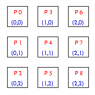
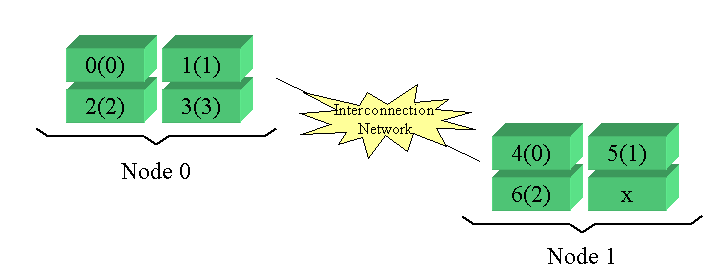

Utility Operations
==================

Global Arrays includes some utility functions to provide process, data
locality, information, check the memory availability, etc. There are
also several handy functions that print array distribution information,
or summarize array usage information.

Locality Information
--------------------

For a given global array element, or a given patch, sometimes it is
necessary to find out who owns this element or patch. The function

- n-D Fortran logical function: `nga_locate <https://hpc.pnl.gov/globalarrays/api/f_op_api.html#ga_locate>`__\ (g_a, subscript, owner) 

- 2-D Fortran logical function: `ga_locate <https://hpc.pnl.gov/globalarrays/api/f_op_api.html#ga_locate>`__\ (g_a, i, j, owner) 

- C:          int `NGA_Locate <https://hpc.pnl.gov/globalarrays/api/c_op_api.html#ga_locate>`__\ (int g_a, int subscript[]) 

- C++:        int GA::GlobalArray::locate(int subscript[])

tells who (process id) owns the elements defined by the array
subscripts.

The function

- n-D Fortran logical function: `nga_locate_region <https://hpc.pnl.gov/globalarrays/api/f_op_api.html#ga_locate_region>`__\ (g_a, lo, hi, map,proclist, np) 

- 2-D Fortran logical function: `ga_locate_region <https://hpc.pnl.gov/globalarrays/api/c_op_api.html#ga_locate_region>`__\ (g_a, ilo, ihi, jlo,jhi, map, np) 

- C:          int `NGA_Locate_region <https://hpc.pnl.gov/globalarrays/api/c_op_api.html#ga_locate_region>`__\ (int g_a, int lo[], int hi[],int \*map[], int procs[]) 

- C++:        int GA::GlobalArray::locateRegion(int lo[], int hi[],int \*map[], int procs[])

returns a list of GA process IDs that 'own' the patch.

The Global Arrays support an abstraction of a distributed array object.
This object is represented by an integer handle. A process can access
its portion of the data in the global array. To do this, the following
steps need to be taken:

#. find the distribution of an array, which part of the data the calling
   process own

#. access the data

#. operate on the date: read/write

#. release the access to the data

The function

- n-D Fortran subroutine: `nga_distribution <https://hpc.pnl.gov/globalarrays/api/f_op_api.html#ga_distribute>`__\ (g_a, iproc, lo, hi) 

- 2-D Fortran subroutine: `ga_distribution <https://hpc.pnl.gov/globalarrays/api/f_op_api.html#ga_distribute>`__\ (g_a, iproc, ilo, ihi, jlo, jhi)

- C:          void `NGA_Distribution <https://hpc.pnl.gov/globalarrays/api/c_op_api.html#ga_distribute>`__\ (int g_a, int iproc, int lo[], int hi[])

- C++:        void GA::GlobalArray::distribution(int iproc, int lo[], int hi[])

finds out the range of the global array ``g_a`` that process ``iproc``
owns and ``iproc`` can be any valid process ID.

The function

- n-D Fortran subroutine: `nga_access <https://hpc.pnl.gov/globalarrays/api/f_op_api.html#ga_access>`__\ (g_a, lo, hi, index, ld) 

- 2-D Fortran subroutine: `ga_access <https://hpc.pnl.gov/globalarrays/api/f_op_api.html#ga_access>`__\ (g_a, ilo, ihi, jlo, jhi, index, ld)

- C:          void `NGA_Access <https://hpc.pnl.gov/globalarrays/api/c_op_api.html#ga_access>`__\ (int g_a, int lo[], int hi[], void \*ptr, int ld[]) 

- C++:        void GA::GlobalArray::access(int lo[], int hi[], void \*ptr, int ld[])

provides access to local data in the specified patch of the array owned
by the calling process. The C interface gives the pointer to the patch.
The Fortran interface gives the patch address as the index (distance)
from the reference address (the appropriate MA base addressing array).

The function

- n-D Fortran subroutine: `nga_release <https://hpc.pnl.gov/globalarrays/api/f_op_api.html#ga_release>`__\ (g_a, lo, hi) 

- 2-D Fortran subroutine: `ga_release <https://hpc.pnl.gov/globalarrays/api/f_op_api.html#ga_release>`__\ (g_a, ilo, ihi, jlo, jhi) 

- C:          void `NGA_Release <https://hpc.pnl.gov/globalarrays/api/c_op_api.html#ga_release>`__\ (int g_a, lo[], int hi[])

- C++:        void GA::GlobalArray::release(lo[], int hi[])

and

- n-D Fortran subroutine: `nga_release_update <https://hpc.pnl.gov/globalarrays/api/f_op_api.html#ga_release_update>`__\ (g_a, lo, hi) 

- 2-D Fortran subroutine: `ga_release_update <https://hpc.pnl.gov/globalarrays/api/f_op_api.html#ga_release_update>`__\ (g_a, ilo, ihi, jlo, jhi)

- C:          void `NGA_Release_update <https://hpc.pnl.gov/globalarrays/api/c_op_api.html#ga_release_update>`__\ (int g_a, int lo[], int hi[]) 

- C++:        void GA::GlobalArray::releaseUpdate(int lo[], int hi[])

releases access to a global array. The former set is used when the data
was read only and the latter set is used when the data was accessed for
writing.

Global Arrays also provide a function to compare distributions of two
arrays. It is

- Fortran subroutine: `ga_compare_distr <https://hpc.pnl.gov/globalarrays/api/f_op_api.html#ga_compare_distr>`__\ (g_a, g_b)

- C:       void `NGA_Compare_distr <https://hpc.pnl.gov/globalarrays/api/c_op_api.html#ga_compare_distr>`__\ (int g_a, int g_b) 

- C++:     void GA::GlobalArray::compareDistr(const GA::GlobalArray \* g_a)

The only method currently available for accessing the ghost cell data
for global arrays that have ghost cell data is to use the
``nga_access_ghosts`` funtion. This function is similar to
the\ ``nga_access`` function already described, except that it returns
an index (pointer) to the origin of the locally held patch of global
array data. This local patch includes the ghost cells so the index
(pointer) will be pointing to a ghost cell. The ``nga_access_ghosts``
function also returns the physical dimensions of the local data patch,
which includes the additional ghost cells, so it is possible to access
both the visible data of the global array and the ghost cells using this
information. The\ ``nga_access_ghosts``\ functions have the format

- n-D Fortran subroutine: `nga_access_ghosts <https://hpc.pnl.gov/globalarrays/api/f_op_api.html#ga_access_ghosts>`__\ (g_a, dims, index, ld) 

- C:           void `NGA_access_ghosts <https://hpc.pnl.gov/globalarrays/api/c_op_api.html#nga_access_ghosts>`__\ (int g_a, int dims[], void \*ptr, int ld[]) 

- C++:         void GA::GlobalArray::accessGhosts(int dims[], void \*ptr, int ld[]) 

The array ``dims`` comes back with the dimensions of the local data
patch, including the ghost cells, for each dimension of the global
array, ``ptr`` is an index (pointer) identifying the beginning of the
local data patch, and ``ld`` is any array of leading dimensions ``fpr``
the local data patch, which also includes the ghost cells. The array
``ld`` is actually redundant since the information in ``ld`` is also
contained in ``dims``, but is included to maintain continuity with other
GA functions.

Process Information 
~~~~~~~~~~~~~~~~~~~

When developing a program, one needs to use charateristics of its
parallel environment: process ID, how many processes are working
together and what their IDs are, and what the topology of processes look
like. To answer these questions, the following functions can be used.

The function

- Fortran integer function: `ga_nodeid <https://hpc.pnl.gov/globalarrays/api/f_op_api.html#ga_nodeid>`__\ () 

- C:       int `GA_Nodeid <https://hpc.pnl.gov/globalarrays/api/c_op_api.html#ga_nodeid>`__\ () 

- C++:     int GA::GAServices::nodeid()

returns the GA process ID of the current process, and the function

- Fortran integer function: `ga_nnodes <https://hpc.pnl.gov/globalarrays/api/f_op_api.html#ga_nnodes>`__\ () 

- C:       int `GA_Nnodes <https://hpc.pnl.gov/globalarrays/api/c_op_api.html#ga_nnodes>`__\ () 

- C++:     int GA::GAServices::nodes()

tells the number of computing processes.

The function

- Fortran subroutine: `ga_proc_topology <https://hpc.pnl.gov/globalarrays/api/f_op_api.html#ga_proc_topology>`__\ (ga, proc, prow, pcol)

- C:       void `NGA_Proc_topology <https://hpc.pnl.gov/globalarrays/api/c_op_api.html#ga_proc_topology>`__\ (int g_a, int proc, int coordinates)

- C++:     void GA::GlobalArray::procTopology(int proc, int coordinates)

determines the coordinates of the specified processor in the virtual
processor grid corresponding to the distribution of array g_a.

*Example*: A global array is distributed on 9 processors. The processors are
numbered from 0 to 8 as shown in the following figure. If one wants to
find out the coordinates of processor 7 in the virtual processor grid,
by calling the fuction ``ga_proc_topology``, the coordinates of
(``2,1``) will be returned.

Cluster Information 
~~~~~~~~~~~~~~~~~~~

The following functions can be used to obtain information like number of
nodes that the program is running on, node ID of the process, and other
cluster information as discussed below:

The function

- Fortran integer function: `ga_cluster_nnodes <https://hpc.pnl.gov/globalarrays/api/f_op_api.html#ga_cluster_nnodes>`__\ () 

- C:       int `GA_Cluster_nnodes <https://hpc.pnl.gov/globalarrays/api/c_op_api.html#ga_cluster_nnodes>`__\ () 

- C++:     int GA::GAServices::clusterNnodes()

returns the total number of nodes that the program is running on. On SMP
architectures, this will be less than or equal to the total number of
processors.

The function

- Fortran integer function: `ga_cluster_nodeid <https://hpc.pnl.gov/globalarrays/api/f_op_api.html#ga_cluster_nodeid>`__\ () 

- C:       int `GA_Cluster_nodeid <https://hpc.pnl.gov/globalarrays/api/c_op_api.html#ga_cluster_nodeid>`__\ () 

- C++:     int GA::GAServices::clusterNodeid()

returns the node ID of the process. On SMP architectures with more than
one processor per node, several processes may return the same node id.

The function

- Fortran integer function: `ga_cluster_nprocs <https://hpc.pnl.gov/globalarrays/api/f_op_api.html#ga_cluster_nprocs>`__\ (inode)

- C:       int `GA_Cluster_nprocs <https://hpc.pnl.gov/globalarrays/api/c_op_api.html#ga_cluster_nprocs>`__\ (int inode) 

- C++:     int GA::GAServices::clusterNprocs(int inode)

returns the number of processors available on node inode.

The function

- Fortran integer function: `ga_cluster_procid <https://hpc.pnl.gov/globalarrays/api/f_op_api.html#ga_cluster_procid>`__\ (inode, iproc) 

- C:       int `GA_Cluster_procid <https://hpc.pnl.gov/globalarrays/api/c_op_api.html#ga_cluster_procid>`__\ (int inode, int iproc) 

- C++:     int GA::GAServices::clusterProcid(int inode, int iproc)

returns the processor id associated with node inode and the local
processor id iproc. If node inode has N processors, then the value of
iproc lies between 0 and N-1.

*Example*: 2 nodes with 4 processors each. Say, there are 7 processes created.
Assume 4 processes on node 0 and 3 processes on node 1. In this case:
number of nodes=2, node id is either 0 or 1 (for example, nodeid of
process 2 is 0), number of processes in node 0 is 4 and node 1 is 3. The
global rank of each process is shown in the figure and also the local
rank (rank of the process within the node.i.e., ``cluster_procid``) is
shown in the parenthesis.

Memory Availability 
-------------------

Even though the memory management does not have to be performed directly
by the user, Global Arrays provide functions to verify the memory
availability. Global Arrays provide the following information:

#. How much memory has been used by the allocated global arrays.

#. How much memory is left for allocation of new the global arrays.

#. Whether the memory in global arrays comes from the `Memory Allocator
   (MA) <https://hpc.pnl.gov/globalarrays/ma/MAapi.html>`__.

#. Is there any limitation for the memory usage by the Global Arrays.

The function

- Fortran integer function: `ga_inquire_memory <https://hpc.pnl.gov/globalarrays/api/f_op_api.html#ga_inquire_memory>`__\ () 

- C:      size_t `GA_Inquire_memory <https://hpc.pnl.gov/globalarrays/api/c_op_api.html#ga_inquire_memory>`__\ () 

- C++:    size_t GA::GAServices::inquireMemory()

answers the first question. It returns the amount of memory (in bytes)
used in the allocated global arrays on the calling processor.

The function

- Fortran integer function: `ga_memory_avail <https://hpc.pnl.gov/globalarrays/api/f_op_api.html#ga_memory_avail>`__\ () 

- C:      size_t `GA_Memory_avail <https://hpc.pnl.gov/globalarrays/api/c_op_api.html#ga_memory_avail>`__\ () 

- C++:    size_t GA::GAServices::memoryAvailable()

answers the second question. It returns the amount of memory (in bytes)
left for allocation of new global arrays on the calling processor.

`Memory Allocator
(MA) <https://hpc.pnl.gov/globalarrays/ma/MAapi.html>`__ is a library of
routines that comprises a dynamic memory allocator for use by C,
Fortran, or mixed-language applications. Fortran- 77 applications
require such a library because the language does not support dynamic
memory allocation. C (and Fortran-90) applications can benefit from
using MA instead of the ordinary malloc() and free() routines because of
the extra features MA provides. The function

- Fortran logical function: `ga_uses_ma <https://hpc.pnl.gov/globalarrays/api/f_op_api.html#ga_uses_ma>`__\ () 

- C:       int `GA_Uses_ma <https://hpc.pnl.gov/globalarrays/api/c_op_api.html#ga_uses_ma>`__\ () 

- C++:     int GA::GAServices::usesMA()

tells whether the memory in Global Arrays comes from the Memory
Allocator (MA) or not.

The function

- Fortran logical function: `ga_memory_limited <https://hpc.pnl.gov/globalarrays/api/f_op_api.html#ga_memory_limited>`__\ () 

- C:       int `GA_Memory_limited <https://hpc.pnl.gov/globalarrays/api/c_op_api.html#ga_memory_limited>`__\ () 

- C++:     int GA::GAServices::memoryLimited()

Indicates if a limit is set on memory usage in Global Arrays on the
calling processor.

Message-Passing Wrappers to Reduce/Broadcast Operations 
-------------------------------------------------------

Global Arrays provide convenient operations for broadcast/reduce
regardless of the message-passing library the process is running with.

The function

- Fortran subroutine: `ga_brdcst <https://hpc.pnl.gov/globalarrays/api/f_op_api.html#ga_brdcst>`__\ (type, buf, lenbuf, root) 

- C:       void `GA_Brdcst <https://hpc.pnl.gov/globalarrays/api/c_op_api.html#ga_brdcst>`__\ (void \*buf, int lenbuf, int root) 

- C++:     void GA::GAServices::brdcst(void \*buf, int lenbuf, int root)

broadcasts from process root to all other processes a message buffer of
length lenbuf.

The functions

- Fortran subroutine: `ga_igop <https://hpc.pnl.gov/globalarrays/api/f_op_api.html#ga_igop>`__\ (type, x, n, op) 
      - subroutine `ga_dgop <https://hpc.pnl.gov/globalarrays/api/f_op_api.html#ga_igop>`__\ (type, x, n, op) 

- C:    void `GA_Igop <https://hpc.pnl.gov/globalarrays/api/c_op_api.html#ga_igop>`__\ (long x[], int n, char \*op) 
      - void `GA_Dgop <https://hpc.pnl.gov/globalarrays/api/c_op_api.html#ga_dgop>`__\ (double x[], int n, char \*op) 

- C++:  void GA::GAServices::igop(long x[], int n, char \*op) 
      - void GA::GAServices::dgop(double x[], int n, char \*op)

'sum' elements of *X(1:N)* (a vector present on each process) across all
nodes using the communicative operator ``op``, The result is broadcasted
to all nodes. Supported operations include
**+, \*, max, min, absmax, absmin**. The integer version also includes
the ``bitwise OR``\ operation.

These operations unlike ``ga_sync``, do not include embedded
``ga_gence`` operations.

Others 
------

There are some other useful functions in Global Arrays. One group is
about inquiring the array attributes. Another group is about printing
the array or part of the array.

Inquire 
~~~~~~~

A global array is represented by a handle. Given a handle, one can get
the array information, such as the array name, memory used, array data
type, and array dimension information, with the help of the following
functions.

The functions

- n-D Fortran subroutine: `nga_inquire <https://hpc.pnl.gov/globalarrays/api/f_op_api.html#ga_inquire>`__\ (g_a, type, ndim, dims) 

- 2-D Fortran subroutine: `nga_inquire <https://hpc.pnl.gov/globalarrays/api/f_op_api.html#ga_inquire>`__\ (g_a, type, dim1, dim2) 

- C:           void `NGA_Inquire <https://hpc.pnl.gov/globalarrays/api/c_op_api.html#ga_inquire>`__\ (int g_a, int \*type, int \*ndim, int dims[]) 

- C++:         void GA::GlobalArray::inquire(int \*type, int \*ndim, int dims[])

return the data type of the array, and also the dimensions of the array.

The function

- Fortran subroutine: `ga_inquire_name <https://hpc.pnl.gov/globalarrays/api/f_op_api.html#ga_inquire_name>`__\ (g_a, array_name) 

- C:       char\* `GA_Inquire_name <https://hpc.pnl.gov/globalarrays/api/c_op_api.html#ga_inquire_name>`__\ (int g_a)  

- C++:     char\* GA::GlobalArray::inquireName()

finds out the name of the array.

One can also inquire the memory being used with ``ga_inquire_memory``
(discussed above).

Print 
~~~~~

Global arrays provide functions to print

#. content of the global array

#. content of a patch of global array

#. the status of array operations

#. a summary of allocated arrays

The function

- Fortran subroutine: `ga_print <https://hpc.pnl.gov/globalarrays/api/f_op_api.html#ga_print>`__\ (g_a) 

- C:       void `GA_Print <https://hpc.pnl.gov/globalarrays/api/c_op_api.html#ga_print>`__\ (int g_a) 

- C++:     void GA::GlobalArray::print()

prints the entire array to the standard output. The output is formatted.

A utility function is provided to print data in the patch, which is

- Fortran subroutine: `nga_print_patch <https://hpc.pnl.gov/globalarrays/api/f_op_api.html#ga_print_patch>`__\ (g_a, lo, hi, pretty) 

- C:       void `NGA_Print_patch <https://hpc.pnl.gov/globalarrays/api/c_op_api.html#ga_print_patch>`__\ (int g_a, int lo[], int hi[], int pretty) 

- C++:     void GA::GlobalArray::printPatch(int lo[], int hi[], int pretty)

One can either specify a formatted output (set ``pretty`` to one) where
the output is formatted and rows/ columns are labeled, or (set
``pretty`` to zero) just dump all the elements of this patch to the
standard output without any formatting.

The function

- Fortran subroutine: `ga_print_stats <https://hpc.pnl.gov/globalarrays/api/f_op_api.html#ga_print_stats>`__\ () 

- C:       void `GA_Print_stats <https://hpc.pnl.gov/globalarrays/api/c_op_api.html#ga_print_stats>`__\ () 

- C++:     void GA::GAServices::printStats()

prints the global statistics information about array operations for the
calling process, including

-  number of calls to the GA create/duplicate, destroy, get, put,
   scatter, gather, and read_and_inc operations

-  total amount of data moved in the GA primitive operations

-  amount of data moved in GA primitive operations to logically remote
   locations

-  maximum memory consumption in global arrays, the high-water mark

The function

- Fortran subroutine: `ga_print_distribution <https://hpc.pnl.gov/globalarrays/api/f_op_api.html#ga_print_distribution>`__\ (g_a) 

- C:       void `GA_Print_distribution <https://hpc.pnl.gov/globalarrays/api/c_op_api.html#ga_print_distribution>`__\ (int g_a)

- C:       void GA::GlobalArray::printDistribution()

prints the global array distribution. It shows mapping array data to the
processes.

The function

- Fortran subroutine: `ga_summarize <https://hpc.pnl.gov/globalarrays/api/f_op_api.html#ga_summarize>`__\ (verbose) 

- C:       void `GA_Summarize <https://hpc.pnl.gov/globalarrays/api/c_op_api.html#ga_summarize>`__\ (int verbose) 

- C++:     void GA::GAServices::summarize(int verbose)

prints info about allocated arrays. verbose can be either one or zero.

Miscellaneous 
~~~~~~~~~~~~~

The function

- Fortran subroutine: `ga_check_handle <https://hpc.pnl.gov/globalarrays/api/f_op_api.html#ga_check_handle>`__\ (g_a, string) 

- C:       void `GA_Check_handle <https://hpc.pnl.gov/globalarrays/api/c_op_api.html#ga_check_handle>`__\ (int g_a, char \*string)

- C++:     void GA::GlobalArray::checkHandle(char \*string)

checks if the global array handle ``g_a`` represents a valid array. The
``string`` is the message to be printed when the handle is invalid.

