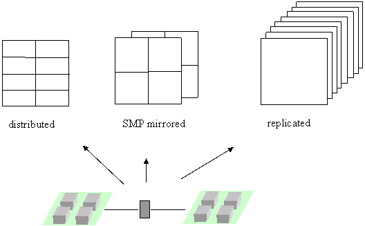

Mirrored Arrays
===============

Overview
--------

Mirrored arrays use a hybrid approach to replicate data across cluster
nodes and distribute data within each node. It uses shared memory for
caching latency sensitive distributed data structures on Symmetric
Multi-Processor nodes of clusters connected with commodity networks as
illustrated in :numref:`Figure %s <MirroredGlobalArray>`. The user is responsible
for managing consistency of the data cached within the mirrored arrays.
Instead of applying mirroring to all distributed arrays, the user can
decide, depending on the nature of the algorithm and the communication
requirements (number and size of messages), which arrays can or should
use mirroring and which should be left fully distributed and accessed
without the shared memory cache.

This hybrid approach is particularly useful for problems where it is
important to solve a moderate sized problem many times, such as an ab
initio molecular dynamics simulation of a moderate size molecule. A
single calculation of the energy and forces that can be run in a few
minutes may be suitable for a geometry optimization, where a few tens of
calculations are required, but is still too long for a molecular
dynamics trajectory, which can require tens of thousands of separate
evaluations. For these problems, it is still important to push
scalability to the point where single energy and force calculations can
be performed on the order of seconds. Similar concerns exist for
problems involving Monte Carlo sampling or sensitivity analysis where it
is important to run calculations quickly so that many samples can be
taken.

Mirrored arrays differ from traditional replicated data schemes in two
ways. First, mirrored arrays can be used in conjunction with distributed
data and there are simple operations that support conversion back and
forth from mirrored to distributed arrays. This allows developers
maximum flexibility in incorporating mirrored arrays into their
algorithms. Second, mirrored arrays are distributed within an SMP node
(see the above figure). For systems with a large number of processors
per node, e.g., 32 in the current generation IBM SP, this can result in
significant distribution of the data. Even for systems with only 2 nodes
per processor, this will result in an immediate savings of 50% over a
conventional replicated data scheme.

.. _MirroredGlobalArray:

   Example of a two-dimensional array fully distributed,
   SMP mirrored, and replicated on two 4-way SMP cluster nodes.

The disadvantage of using mirrored arrays is that problems are limited
in size by what can fit onto a single SMP node. This can be partially
offset by the fact that almost all array operations can be supported on
both mirrored and distributed arrays, so that it is easy to develop code
that can switch between using mirrored arrays and conventional
distributed arrays, depending on problem size and the number of
available processors.

Mirrored Array Operations
-------------------------

- Fortran integer: `ga_pgroup_get_mirror <https://hpc.pnl.gov/globalarrays/api/f_op_api.html#GA_PGROUP_GET_MIRROR>`__\ () 

- C:       int `ga_pgroup_get_mirror <https://hpc.pnl.gov/globalarrays/api/c_op_api.html#GA_PGROUP_GET_MIRROR>`__\ () 

- C++:     int GA::GAServices::pgroupGetMirror()

This function returns a handle to the mirrored processor list, which can
then be used to create a mirrored global array using one of the
``NGA_Create_*_config`` calls.

- Fortran integer: `ga_merge_mirrored <https://hpc.pnl.gov/globalarrays/api/f_op_api.html#GA_MERGE_MIRRORED>`__\ (g_a) 

- C:       int `GA_Merge_mirrored <https://hpc.pnl.gov/globalarrays/api/c_op_api.html#GA_MERGE_MIRRORED>`__\ (int g_a) 

- C++:     int GA::GlobalArray::mergeMirrored()

This subroutine merges mirrored arrays by adding the contents of each
array across nodes. The result is that the each mirrored copy of the
array represented by g_a is the sum of the individual arrays before the
merge operation. After the merge, all mirrored arrays are equal. This is
a collective operation.

- Fortran integer: `nga_merge_distr_patch <https://hpc.pnl.gov/globalarrays/api/f_op_api.html#GA_MERGE_DISTR_PATCH>`__\ (g_a, alo, ahi, g_b, blo, bhi) 

- C:       int `NGA_Merge_distr_patch <https://hpc.pnl.gov/globalarrays/api/c_op_api.html#GA_MERGE_DISTR_PATCH>`__\ (int g_a, int alo[], int ahi[], int g_b, int blo[], int bhi[]) 

- C++:     int GA::GlobalArray::mergeDistrPatch(int alo[], int ahi[], int g_b, int blo[], int bhi[])

This function merges all copies of a patch of a mirrored array (g_a)
into a patch in a distributed array (g_b). This is same as
GA_merge_mirrored, except, this function is operated on a patch rather
than the whole array. This is a collective operation.

- Fortran integer: `ga_is_mirrored <https://hpc.pnl.gov/globalarrays/api/f_op_api.html#ga_is_mirrored>`__\ (g_a) 

- C:       int `GA_Is_mirrored <https://hpc.pnl.gov/globalarrays/api/c_op_api.html#ga_is_mirrored>`__\ (int g_a) 

- C++:     int GA::GlobalArray::isMirrored()

This subroutine checks if the array is mirrored array or not. Returns 1
if it is a mirrored array, else it returns 0. This is a local operation.
