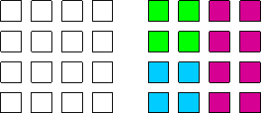

Processor Groups
================

Overview
--------

The Global Arrays toolkit has recently been extended to support global
arrays defined on processor groups. The processor groups in GA programs
follow the MPI approach. The MPI processor groups can be used in GA
programs. However, since the MPI standard does not support fault
tolerance, GA provides a set of APIs for process group managment which
offers some opportunities for supporting environments with hardware
faults.

In general, processor groups allow the programmer to subdivide the
domain containing the complete set of processors (“the world group”)
into subsets of processors that can act more or less independently of
one another. Global arrays that are created on processor groups are only
distributed amongst the processors in the group and not on all
processors in the system. Collective operations executed on specific
groups are also restricted to processors in the group and do not require
any action from processors outside the group. A simple example is a
synchronization operation. If the synchronization operation is executed
on a group that is a subgroup of the world group, then only those
processors in the subgroup are blocked until completion of the
synchronization operation. Processors outside the subgroup can continue
their operations without interruption.

The Global Arrays toolkit contains a collection of library calls that
can be used to explicitly create groups, assign specific groups to
global arrays, and execute global operations on groups. There is also a
mechanism for setting the “default” group for the calculation. This is a
powerful way of converting large amounts of parallel code that has
already been written using the Global Arrays library to run as a
subroutine on a processor group. Normally, the default group for a
parallel calculation is the world group, but a call is available that
can be used to change the default group to something else. This call
must be executed by all processors in the subgroup. Furthermore,
although it is not required, it is probably a very good idea to make
sure that the default groups for all processors in the system (i.e., all
processors contained in the original world group) represent a complete
non-overlapping covering of the original world group (see figure). Once
the default group has been set, all operations are implicitly assumed to
occur on the default processor group unless explicitly stated otherwise.
Global Arrays are only created on the default processor group and global
operations, such as synchronizations, broadcasts, and other operations,
are restricted to the default group. Inquiry functions, such as the
number of nodes and the node ID, return values relative to the default
processor group. Thus, a call to the ga_nodeid function will return a
value of 0 for each processor designated as the zero processor within
each default group. The number of processors returning 0 will be equal
to the number of default groups (assuming the complete non-overlapping
coverage suggested above is implemented).

   
   Original set of 16 processors decomposed into 3 non-overlapping groups.

At present there are not many function calls that support operations
between groups. The only calls that can be used to copy data from one
group to another are the ``nga_copy`` and ``nga_copy_patch`` calls.
These can be used to copy global arrays between two groups, provided
that one group is completely contained in the other (this will always be
the case if one of the groups is the world group). These commands will
work correctly as long as they are executed only by processors contained
in the smaller group. The ``nga_put`` and ``nga_get`` commands can also
be used to communicate between Global Arrays on different groups (using
an intermediate buffer), provided that the two groups share at least one
processor (again, this will always be the case if one group is the world
group). The new functions included in the Global Arrays library are described
below.

Creating New Groups
-------------------

- Fortran integer function: `ga_pgroup_create <https://hpc.pnl.gov/globalarrays/api/f_op_api.html#GA_PGROUP_CREATE>`__\ (list, size)

- C:       int `GA_Pgroup_create <https://hpc.pnl.gov/globalarrays/api/c_op_api.html#GA_PGROUP_CREATE>`__\ (int \*list, int size)
  
This call can be used to create a processor group of size ``size``
containing the processors in the array ``list``. This call must be
executed on all processors in the group. It returns an integer handle
(for the processors group) that can be used to reference the processor
group in other library calls.

Assigning groups:

- Fortran subroutine: `ga_set_pgroup <https://hpc.pnl.gov/globalarrays/api/f_op_api.html#GA_SET_PGROUP>`__\ (g_a, p_handle)

- C:       void `GA_Set_pgroup <https://hpc.pnl.gov/globalarrays/api/c_op_api.html#GA_SET_PGROUP>`__\ (int g_a, int p_handle)

This call can be used to assign the processor group ``p_handle`` to a
global array handle ``g_a`` that has been previously created using the
``ga_create_handle`` call. The processor group associated with a global
array can also be set by creating the global array with one of the
``nga_create_XXX_config`` calls.

Setting the Default Group
-------------------------

- Fortran subroutine: `ga_pgroup_set_default <https://hpc.pnl.gov/globalarrays/api/f_op_api.html#GA_PGROUP_SET_DEFAULT>`__\ (p_handle)

- C:       void `GA_Pgroup_set_default <https://hpc.pnl.gov/globalarrays/api/c_op_api.html#GA_PGROUP_SET_DEFAULT>`__\ (int p_handle)

This call can be used to set the default group to something besides the
world group. This call must be made on all processors contained in the
group represented by ``p_handle``. Once the default group has been set,
all operations are restricted to the default group unless explicitly
stated otherwise.

Inquiry functions
-----------------

- Fortran integer function: `ga_pgroup_nnodes <https://hpc.pnl.gov/globalarrays/api/f_op_api.html#GA_PGROUP_NNODES>`__\ (p_handle)

- C:       int `GA_Pgroup_nnodes <https://hpc.pnl.gov/globalarrays/api/c_op_api.html#GA_PGROUP_NNODES>`__\ (int p_handle)

- Fortran integer function: `ga_pgroup_nodeid <https://hpc.pnl.gov/globalarrays/api/f_op_api.html#GA_PGROUP_NODEID>`__\ (p_handle)

- C:       int `GA_Pgroup_nodeid <https://hpc.pnl.gov/globalarrays/api/c_op_api.html#GA_PGROUP_NODEID>`__\ (int p_handle)

These functions can be used to access information about the group. The
``ga_pgroup_nnodes`` function returns the number of processors in the
group specified by the handle ``p_handle``, ``ga_pgroup_nodeid`` returns
the local node ID of the processor within the group.

- Fortran integer function: `ga_pgroup_get_default <https://hpc.pnl.gov/globalarrays/api/f_op_api.html#GA_PGROUP_GET_DEFAULT>`__\ ()

- C:       int `GA_Pgroup_get_default <https://hpc.pnl.gov/globalarrays/api/c_op_api.html#GA_PGROUP_GET_DEFAULT>`__\ ()

- Fortran integer function: `ga_pgroup_get_mirror <https://hpc.pnl.gov/globalarrays/api/f_op_api.html#GA_PGROUP_GET_MIRROR>`__\ ()

- C:       int `GA_Pgroup_get_mirror <https://hpc.pnl.gov/globalarrays/api/c_op_api.html#GA_PGROUP_GET_MIRROR>`__\ ()

- Fortran integer function: `ga_pgroup_get_world <https://hpc.pnl.gov/globalarrays/api/f_op_api.html#GA_PGROUP_GET_WORLD>`__\ ()

- C:       int `GA_Pgroup_get_world <https://hpc.pnl.gov/globalarrays/api/c_op_api.html#GA_PGROUP_GET_WORLD>`__\ ()

These functions can be used to get the handles for some standard groups
at any point in the program. This is particularly useful for gaining
access to the world group if the default group has been reset to a
subgroup and also for gaining access to the handle for the mirror group
(see section on mirrored arrays). Note that the mirror group is actually
a group defined on the complete set of processors.

Collective operations on groups
-------------------------------

- Fortran subroutine: `ga_pgroup_sync <https://hpc.pnl.gov/globalarrays/api/f_op_api.html#GA_PGROUP_SYNC>`__\ (p_handle)

- C:       void `ga_pgroup_sync <https://hpc.pnl.gov/globalarrays/api/f_op_api.html#GA_PGROUP_SYNC>`__\ (p_handle)

- Fortran subroutine: `ga_pgroup_brdcst <https://hpc.pnl.gov/globalarrays/api/f_op_api.html#GA_PGROUP_BRDCST>`__\ (p_handle,type, buf,lenbuf,root)

- C:       void `GA_Pgroup_brdcst <https://hpc.pnl.gov/globalarrays/api/f_op_api.html#GA_PGROUP_BRDCST>`__\ (int p_handle, void \*buf, root)

- Fortran subroutine: `ga_pgroup_dgop <https://hpc.pnl.gov/globalarrays/api/f_op_api.html#GA_PGROUP_DGOP>`__\ (p_handle, type, buf, lenbuf, op)

- Fortran subroutine: `ga_pgroup_sgop <https://hpc.pnl.gov/globalarrays/api/f_op_api.html#GA_PGROUP_SGOP>`__\ (p_handle, type, buf, lenbuf, op)

- Fortran subroutine: `ga_pgroup_igop <https://hpc.pnl.gov/globalarrays/api/f_op_api.html#GA_PGROUP_IGOP>`__\ (p_handle, type, buf, lenbuf, op)

- C:       void `GA_Pgroup_dgop <https://hpc.pnl.gov/globalarrays/api/c_op_api.html#GA_PGROUP_DGOP>`__\ (int p_handle, double \*buf, int lenbuf, char \*op)

- C:       void `GA_Pgroup_fgop <https://hpc.pnl.gov/globalarrays/api/c_op_api.html#GA_PGROUP_FGOP>`__\ (int p_handle, float \*buf, int lenbuf, char \*op)

- C:       void `GA_Pgroup_igop <https://hpc.pnl.gov/globalarrays/api/c_op_api.html#GA_PGROUP_IGOP>`__\ (int p_handle, int \*buf, int lenbuf, char \*op)

- C:       void `GA_Pgroup_lgop <https://hpc.pnl.gov/globalarrays/api/c_op_api.html#GA_PGROUP_LGOP>`__\ (int p_handle, long \*buf, int lenbuf, char \*op) 

These operations are
all identical to the standard global operations, the only difference is
that they have an extra argument that takes a group handle. The action
of these calls is restricted to the set of processors contained in the
group represented by ``p_handle``. All processors in the group must call
these subroutines.

